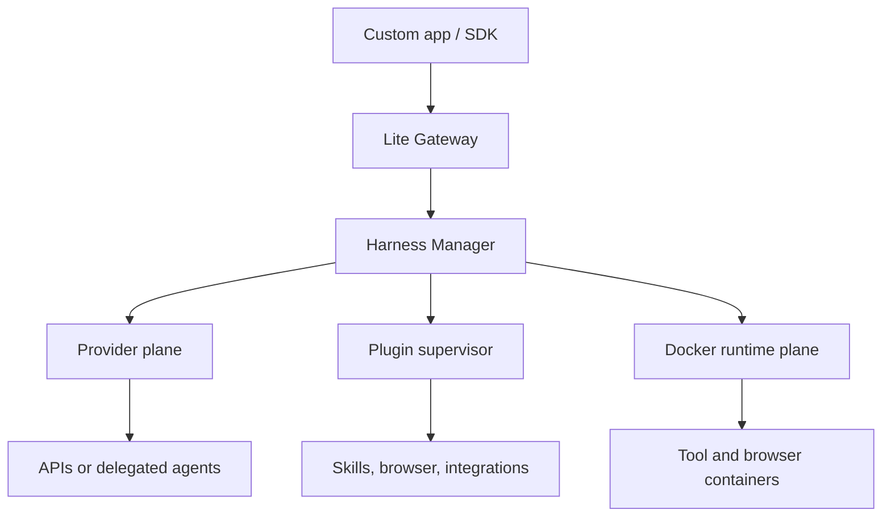
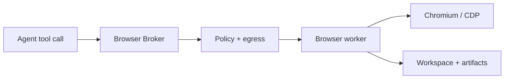

# Lite-Harness: End-to-End Architecture, Transformation, and Build Plan

Status: revised architecture-freeze candidate (v2)  
Date: July 14, 2026  
Scope: local, single-host, regular Docker on Linux, macOS, and Windows  
Audience: a motivated builder who is still learning systems engineering

Revision note: version two corrects an important product mistake in the first
draft. **Lite means a small modular core and low idle cost, not a small feature
set.** Plugins, skills, integrations, browser automation, scheduled work,
subagents, memory, and broad provider support belong in the product. They stay
outside the kernel and cost nothing when they are not installed or enabled.

## Important naming note

Lite-Harness works as an internal codename, but a public project named
LiteLLM-Labs/lite-harness already exists and launched in 2026. It also offers a
unified agent SDK. Before publishing packages, domains, or branding, choose a
distinct public name and check GitHub, npm, PyPI, domains, and trademarks.

This document keeps using Lite-Harness so the architecture discussion remains
consistent. Renaming should not change the design.

## 1. The short version

Lite-Harness should become an **application-embeddable agent platform**: the
useful harness and ecosystem people expect from OpenClaw, rebuilt around a much
smaller deployment-focused core.

It is not a lightly edited fork and it is not “OpenClaw minus features.” The
kernel should know how to authorize a run, persist its state, execute an agent
loop, enforce policy, load capabilities, route model work, and emit events. It
should know almost nothing about Slack, Playwright, Anthropic, Codex, a specific
skill format, or a particular Docker image. Those arrive through versioned
provider, capability, and integration contracts.

The default local deployment has a few trusted host processes and disposable
Docker containers:



The normal model loop and all permanent credentials remain in trusted host-side
components. Disposable containers run untrusted tools, plugin workloads, and
browser processes. Provider secrets, workspace encryption keys, the database,
and the Docker socket never enter a general agent tool container.

Gateway and Manager can ship in one installer and start together, but they stay
separate processes. Manager can control Docker, which is effectively host-level
power; the public Gateway must not have that power. Provider workers and plugin
workers are additional isolation boundaries that start only when required.

The first deployment target remains one local machine running regular Docker on
Linux, macOS, or Windows. The interfaces are cloud-ready, but version one does
not require cloud infrastructure.

## 2. What the product is

The product promise is:

> Add a secure, stateful, extensible agent to an app with a few API or SDK
> calls, while Lite-Harness handles models, provider login, streaming, tools,
> plugins, skills, integrations, browser work, Docker, workspaces, sessions,
> budgets, cleanup, and recovery.

An app builder should be able to:

1. Define an agent recipe.
2. Create or reuse a workspace.
3. Start a run.
4. Stream text, tool, approval, usage, and artifact events.
5. Cancel or steer the run.
6. Resume the event stream after disconnecting.
7. Reuse the same session and workspace later.
8. Pay no active container CPU or RAM cost while the agent is idle.
9. Install a capability pack without changing Gateway or the agent kernel.
10. Connect provider accounts and let a policy choose a compatible model.
11. Receive work from an integration such as a webhook or chat adapter.
12. Run browser, coding, research, or automation workflows under the same
    permissions and event model.

The product has two equally important surfaces:

- **Embeddable mode:** an app controls agents through REST, SSE, WebSocket, or
  TypeScript/Python SDKs.
- **OpenClaw-style mode:** installed capabilities provide skills, integrations,
  browser tools, automation, memory, and interactive agent workflows.

Both surfaces call the same kernel. There must not be a separate “SDK agent
system” and “personal assistant agent system” that slowly drift apart.

### Plain-English mental model

Think of Lite-Harness like a secure movie studio:

| Part | Studio analogy | Actual job |
| --- | --- | --- |
| Gateway | Front desk | checks which app/user may ask for what |
| Manager | Producer | coordinates the run and owns privileged operations |
| Agent Kernel | Director + referee | runs the model/tool loop and enforces the script/policy |
| Provider Plane | Casting and billing desk | chooses an allowed model/account and translates its protocol |
| Plugin Supervisor | Contractor office | starts optional specialists with only their granted access |
| Docker Runtime | Disposable soundstage | contains shell, code, plugin, or browser work |
| Workspace Service | Locked prop warehouse | keeps durable files while stages come and go |
| Event Log | Camera footage | records ordered facts so a crash can be replayed/recovered |

OpenClaw supplies many talented “departments.” Lite-Harness keeps the useful
work they perform, but every department signs the same contract with the new
studio instead of owning hallways into every other room.

## 3. Scope boundaries

Do not build these infrastructure systems in the local Docker release:

- Kubernetes
- Micro-VMs
- Multiple worker machines
- Redis, Kafka, or a distributed scheduler
- S3 or a cloud object store
- Hostile multi-tenant cloud isolation
- Native Windows containers
- Global deduplication of private user files
- Content-defined chunking or a custom distributed filesystem
- A generic cache for every mysterious directory
- A hosted public marketplace with payments or automatic trust
- Arbitrary tenant JavaScript loaded into the Gateway or Manager
- A vector database just because it sounds agentic
- pxpipe enabled by default

The following are **part of Lite-Harness**, but live in optional capability
packs and can ship in stages after the kernel works:

- OpenClaw-compatible skills and plugin migration
- Browser automation and remote-CDP support
- MCP and app callback tools
- Chat, webhook, source-control, email, and productivity integrations
- Scheduled jobs and event-triggered automation
- Subagents and delegated coding-agent backends
- Search/retrieval memory
- Voice, live canvas, and companion-device adapters if real demand justifies
  them

This distinction matters. “Not hard-coded into the first kernel milestone” is
not the same as “removed from the product.” A disabled pack must add no open
port, background process, large dependency, or container. A webhook-based pack
can be idle until an event arrives; a polling or socket-based connector must
honestly keep a small connector worker alive while enabled.

## 4. The five words that must stay separate

These concepts sound similar but represent different things.

| Object | Plain-English meaning | How long it lives |
| --- | --- | --- |
| Agent | A versioned recipe: model, instructions, tools, skills, limits | Until deleted |
| Session | The conversation and context history | Across many runs |
| Workspace | Durable files the agent works on | Across many runs and sessions |
| Run | One attempt to perform one task | Minutes or hours |
| Runtime | A temporary Docker container used for execution | Only while needed |

One agent recipe can be used for many sessions. A session can have many runs.
A workspace can outlive all of its containers. A container can be deleted
without deleting the session or workspace.

This separation prevents a common systems mistake: treating a container as the
thing that owns the user's important state.

## 5. Architecture decisions to freeze

These are the recommended non-negotiable decisions for the architecture.

1. TypeScript and Node are the main implementation stack.
2. The project is a pnpm monorepo.
3. The model and agent loop run on the host in Harness Manager.
4. Docker runs untrusted tool execution, not the model-provider client.
5. Lite Gateway and Harness Manager are separate process roles.
6. They communicate only through a narrow local socket or named-pipe protocol.
7. Gateway never accepts raw Docker options, paths, mounts, or commands.
8. Every public request is authorized against app, tenant, user, and resource.
9. External tokens are short-lived opaque bearer tokens, not custom encrypted
   tokens.
10. Manager receives a resolved internal principal, never the external token.
11. SQLite in WAL mode is the first database.
12. Runs and events are durable database records, not process-memory objects.
13. One writable run owns a workspace at a time.
14. Every workspace lease has a fencing number to reject stale writers.
15. Managed Docker named volumes are the default workspace mode.
16. Explicitly registered host-project bind mounts are an optional developer
    mode.
17. Cold workspaces use compressed, authenticated encrypted snapshots.
18. Private cache content is never shared across tenants only because its hash
    matches.
19. Docker and BuildKit own image and build-layer caching.
20. pxpipe is an optional context-encoding plugin after model selection.
21. Canonical context always remains exact text, even if an image view is sent
    to a model.
22. Regular Docker is described honestly as containment, not micro-VM-grade
    tenant security.
23. The kernel depends on contracts, never on a concrete provider, integration,
    browser, or third-party plugin.
24. Large features are capability packs that are lazy-started and removable.
25. Third-party plugins run out of process by default; only reviewed built-ins
    may run in a trusted host process.
26. Direct model APIs use the native Lite-Harness loop. Subscription-backed
    Codex or Claude workflows use supervised delegated-agent adapters.
27. App authentication, provider authentication, and integration
    authentication are three separate security domains.
28. Provider credentials are referenced by opaque profile IDs and resolved by
    a Credential Broker; they are never copied into agent prompts or ordinary
    tool containers.
29. Model routing is capability- and policy-based, not a string-replacement
    fallback list.
30. A canonical request/context representation is compiled only after the
    final provider, model, transport, and credential route is selected.
31. OpenClaw compatibility is an adapter and migration path, not the permanent
    internal architecture.
32. The compatibility test suite decides what behavior is preserved; file and
    folder similarity to OpenClaw is not a goal.

## 6. Recommended topology

### Lite Gateway

Lite Gateway is the bouncer at the front door.

It owns:

- HTTPS or loopback HTTP
- REST endpoints
- WebSocket and Server-Sent Event streams
- API keys and short-lived run tokens
- App, tenant, user, and scope checks
- Rate limits and budget prechecks
- Idempotency handling
- Durable outward-facing event delivery
- OpenAPI documentation
- SDK compatibility
- Provider-login initiation and callback routing
- Plugin, skill, integration, and model-management API surfaces

It must not own:

- Docker access
- Workspace encryption keys
- Arbitrary host filesystem access
- Runtime image selection from untrusted input

### Harness Manager

Harness Manager is the stage manager.

It owns:

- The agent loop
- Provider routing requests, never raw provider credentials
- Run scheduling and state transitions
- Workspace leases
- Docker creation, execution, inspection, stopping, and cleanup
- Workspace checkpoint and restore
- Tool-policy enforcement
- Cancellation and timeout handling
- Crash reconciliation
- Usage and terminal-result reporting
- Capability resolution and immutable run snapshots
- Delegated-agent supervision

Its internal API should stay narrow:

    StartRun
    CancelRun
    GetRun
    SubscribeRunEvents
    PrepareWorkspace
    CheckpointWorkspace
    ResolveCapabilities
    InvokeProvider
    InspectHealth

The API must not accept arbitrary Docker flags, host paths, image names,
entrypoints, devices, mounts, or environment variables. An external request
selects a registered agent profile. Manager resolves the actual trusted
runtime configuration.

### Provider Plane

The Provider Plane turns a provider-neutral request into one provider-specific
operation. It is split into small modules rather than one giant switch
statement:

- **Credential Broker:** owns encrypted provider profiles, refresh locks,
  expiry, revocation, and ephemeral credential handoff.
- **Model Registry:** owns model identities, aliases, capabilities, limits,
  pricing metadata, discovery snapshots, and health.
- **Router:** filters and scores routes against required capabilities, policy,
  cost, latency, account availability, and health.
- **Provider adapters:** compile requests, normalize streams, classify errors,
  and report usage for one provider protocol.
- **Delegated-agent adapters:** supervise official Codex or Claude runtimes when
  a subscription-backed workflow is selected.

Provider workers receive only the credential material for one authorized
operation. General plugin and tool workers never receive provider secrets.

### Plugin Supervisor and Capability Broker

The Plugin Supervisor installs, validates, starts, stops, and health-checks
optional capability packs. Third-party code runs in a worker process or a
container and communicates over a versioned RPC protocol.

The Capability Broker is the plugin's narrow doorway to Lite-Harness. A plugin
can request declared operations such as emitting an event, reading its scoped
state, invoking an approved model route, opening an allowed network
destination, or publishing an artifact. It cannot receive the database handle,
Docker socket, root encryption key, or all installation secrets.

Reviewed built-in modules may use an in-process fast path. “Trusted built-in”
must be an explicit manifest property and build-time allowlist, not something a
downloaded plugin can claim.

### Capability Packs

Capability packs are cohesive optional products assembled from plugins, tools,
skills, runtime profiles, and integration adapters. Initial official packs
should include:

- coding and shell tools
- browser automation
- MCP tools
- memory and search
- automation and schedules
- OpenClaw compatibility
- selected chat and productivity integrations

A pack has a manifest, version, digest, configuration schema, permission list,
dependency list, and migrations. Disabling a pack stops its workers and removes
its tools from future run snapshots without corrupting old run records.

### Workspace Service

Workspace Service is a logical module inside Manager in version one. It is the
warehouse that stores and restores the user's boxes.

It owns:

- Managed Docker volumes
- Host-project registrations
- Snapshot manifests
- Compression and encryption
- Artifact export
- Cache attachment plans
- Disk quotas and garbage collection

Docker pulls images. Workspace Service restores data. Do not blur those jobs.

### Docker Runtime

The Docker container is a temporary rented workroom.

It receives:

- A writable workspace mount
- Explicit cache mounts
- A minimal non-secret environment
- Tool commands
- Resource and network policy

It never receives:

- Provider API keys
- Database credentials
- Workspace encryption keys
- App API keys
- The Docker socket
- The host home directory

### Storage

Version one uses:

- SQLite database files for metadata and ordered events
- Docker volumes for warm managed workspaces
- A local blob directory for encrypted snapshots and artifacts
- The operating-system keychain for the installation root key

Every storage implementation sits behind an interface so local files can later
be replaced by Postgres and object storage without changing the public API.

## 7. One complete run, end to end

### Step 1: the app authenticates its user

The consuming app decides who its user is. Lite-Harness does not need to become
the app's login system.

The app backend uses its server-only project credential to ask Lite Gateway for
a short-lived run token. The token is bound to:

- app ID
- tenant ID
- user ID
- agent profile
- workspace
- allowed operations
- model and tool budget
- expiry
- one-time or reusable status

Browser, mobile, or desktop code receives only that short-lived token. It never
contains the permanent project secret.

### Step 2: the SDK creates a run

The SDK sends a request similar to:

    POST /v1/runs
    Authorization: Bearer <short-lived-token>
    Idempotency-Key: <random-request-id>

    {
      agent: "coder-v3",
      session: "optional-existing-session",
      workspace: "project-123",
      input: "Fix the failing tests"
    }

Gateway validates the token, authorizes every referenced object, checks quotas,
and immediately returns:

    {
      run_id: "run_...",
      status: "accepted",
      event_cursor: 0
    }

Immediate acceptance keeps web requests short. The actual task continues in
the background.

### Step 3: Gateway creates an internal command

Gateway converts the token into an internal principal:

    app_id
    tenant_id
    user_id
    agent_profile_id
    workspace_id
    scopes
    budgets
    request_id
    policy_hash
    expires_at

It sends that principal and the command to Manager over a protected Unix socket
on Linux/macOS or an ACL-protected named pipe on Windows. It does not forward
the external bearer token.

### Step 4: Manager leases the workspace

Manager opens a transaction and obtains the workspace's exclusive writable
lease.

The lease receives a monotonically increasing epoch:

    workspace lease epoch 41

If an old Manager attempt later wakes up and tries to write using epoch 40, the
database rejects it. This is called fencing. It prevents two crashed or delayed
processes from both believing they own the same files.

Additional writable runs for the same workspace queue in version one.

### Step 5: Workspace Service prepares the files

If the managed volume still exists, it becomes the warm workspace.

If the workspace is cold:

1. Create a new staging Docker volume.
2. Read the encrypted snapshot from local blob storage.
3. Verify its authenticated encryption and manifest.
4. Decrypt and decompress it as a stream.
5. Restore through a pinned helper container.
6. Validate size, paths, links, and entry limits.
7. Mark the staging volume as the current volume in one transaction.
8. Clean old staging data later.

Never restore over the only good copy.

### Step 6: Manager resolves the runtime

The agent profile points to a trusted runtime profile, not free-form Docker
input.

Manager resolves:

- Pinned image digest
- CPU, memory, process, file, and time limits
- Workspace and cache mounts
- Tool bundle version
- Network mode
- Non-root user
- Security policy version

It calculates a runtime configuration hash. A warm container is reused only if
its labels match that exact configuration.

### Step 7: Manager starts the agent loop

Manager first freezes a run snapshot containing the exact agent version,
skills, plugins, tools, provider policy, integration origin, budgets, and
runtime profiles. Updating a plugin while a run is active cannot change that
run underneath it.

For a native-loop route, the agent loop lives in Manager:

1. Load canonical session messages.
2. Load the immutable agent-version snapshot.
3. Load the permitted skill catalog.
4. Resolve permitted tools.
5. Compile context.
6. Ask the Router for compatible provider/model/credential candidates.
7. Select one route and compile canonical context for its exact capabilities.
8. Optionally apply conservative context optimization.
9. Ask Credential Broker for a one-operation credential handoff to the trusted
   provider worker.
10. Stream normalized provider events back into the agent loop.

For a delegated-agent route, such as Codex app-server or Claude Code, Manager
starts the reviewed adapter in an isolated local process, binds it to the run's
workspace and policy, and normalizes its stream into the same run events. Lite
still owns authorization, budgets, approvals, artifacts, cancellation, and
audit history even when the delegated runtime owns an inner model/tool loop.

The provider credential never crosses into a general Docker tool container.

### Step 8: tool calls execute

When the model requests a tool:

1. Validate the tool name and JSON arguments.
2. Confirm the tool was shown to this run.
3. Reauthorize it against the current run policy.
4. Request approval if required.
5. Execute shell and file operations inside Docker.
6. Execute reviewed control-plane tools in a trusted host module.
7. Route third-party plugin and integration tools through their isolated worker.
8. Execute app callback tools as signed outbound requests.
9. Enforce timeout, output-size, network, and artifact limits.
10. Persist a tool-result event.
11. Feed the result back to the model loop or delegated adapter.

Policy is enforced twice: forbidden tools are hidden from the model, and every
actual invocation is checked again.

### Step 9: events stream to the app

Every event receives a sequence number:

    run.accepted
    workspace.restoring
    runtime.starting
    agent.message.delta
    tool.call.requested
    approval.requested
    tool.call.completed
    usage.updated
    artifact.created
    provider.route.selected
    plugin.health.changed
    browser.page.changed
    run.completed

The SDK remembers the latest sequence number. If the network disconnects, it
reconnects with an after cursor and receives the missing events.

### Step 10: the run ends safely

On success, failure, cancellation, or timeout:

1. Stop the model loop.
2. Send graceful termination to active tool processes.
3. Wait for a bounded grace period.
4. Kill processes that ignore termination.
5. Inspect container exit and out-of-memory state.
6. Stop and remove the run container.
7. Mark the workspace dirty if files changed.
8. Schedule a debounced checkpoint.
9. Release the workspace lease.
10. Commit the terminal run state.

The warm volume consumes disk but no CPU or RAM. A later compactor can make it
cold.

## 8. Run and workspace state machines

Run states:

    ACCEPTED
      -> QUEUED
      -> PREPARING
      -> RUNNING
      -> CHECKPOINTING
      -> SUCCEEDED

At appropriate points a run may instead become FAILED, CANCELLED, TIMED_OUT,
or ORPHANED. Terminal states never return to running; a retry creates a new
attempt.

Workspace states:

    COLD
      -> RESTORING
      -> WARM
      -> IN_USE
      -> SNAPSHOTTING
      -> WARM or COLD

CORRUPT and ERROR are explicit states. They should not be hidden behind a
generic exception because recovery behavior differs.

## 9. Public API and SDK

### Canonical REST surface

Start with a small stable API:

    POST   /v1/tokens
    POST   /v1/agents
    GET    /v1/agents/{id}
    POST   /v1/workspaces
    GET    /v1/workspaces/{id}
    POST   /v1/sessions
    GET    /v1/sessions/{id}
    POST   /v1/runs
    GET    /v1/runs/{id}
    POST   /v1/runs/{id}/cancel
    POST   /v1/runs/{id}/steer
    GET    /v1/runs/{id}/events
    POST   /v1/runs/{id}/approvals/{approval_id}
    GET    /v1/artifacts/{id}
    GET    /v1/models
    GET    /v1/provider-connections
    POST   /v1/provider-connections
    POST   /v1/provider-connections/{id}/login
    DELETE /v1/provider-connections/{id}
    GET    /v1/plugins
    POST   /v1/plugins/{id}/enable
    POST   /v1/plugins/{id}/disable
    GET    /v1/skills
    GET    /v1/integrations
    POST   /v1/integrations/{id}/accounts
    POST   /v1/schedules
    GET    /healthz
    GET    /readyz

Use idempotency keys on every side-effecting call.

The first alpha does not need to implement every endpoint in this list. The
resource model and naming should be reserved early so providers, plugins, and
integrations do not invent private side APIs later.

### Streaming

Support three access levels:

1. REST for creating, cancelling, and checking objects.
2. SSE for simple one-way event streaming in web apps.
3. WebSocket for bidirectional streaming, steering, approvals, and custom
   tool callbacks.

Use OpenClaw's simple typed envelope pattern:

    request  = type, id, method, params
    response = type, id, ok, payload or error
    event    = type, event, payload, sequence

Add durable replay, which OpenClaw's Gateway protocol does not provide.

### SDK order

Build SDKs in this order:

1. TypeScript
2. Raw HTTP/OpenAPI examples
3. Python after the API stops moving
4. Framework helpers for Next.js or other web stacks
5. Framework helpers and optional MCP/provider-compatible adapters

The SDK should remain thin. Important logic belongs on the server so a security
fix does not require every app to update immediately.

A TypeScript user experience should eventually feel like:

    const client = new LiteHarness({ baseUrl, token })
    const run = await client.runs.create({
      agent: "coder",
      workspace: "demo",
      input: "Build a small API"
    })

    for await (const event of run.events()) {
      // update the app UI
    }

## 10. The three kinds of authentication

Lite-Harness has three unrelated kinds of secrets. Mixing them is how systems
accidentally leak a user's ChatGPT login to a tool container or let a Slack
token authorize a workspace.

| Security domain | Proves | Examples | Owner |
| --- | --- | --- | --- |
| App auth | Which app/user may call Lite | project key, short run token | Gateway |
| Provider auth | Which account may pay for model work | API key, OAuth profile, delegated CLI login | Credential Broker |
| Integration auth | Which external service account may receive/send events | Slack OAuth, GitHub App token | Integration worker + broker |

No token is valid in more than one domain. Database records refer to opaque
credential profile IDs; they never reuse a credential as an object identifier.

### App authentication explained simply

An access token is like a temporary festival wristband. It proves what entrance
the holder may use and when it expires. Painting the wristband with secret ink
does not stop someone who steals it from using it.

That is why Lite-Harness should not invent an encrypted SDK token.

Use:

- TLS when traffic leaves the machine
- A random 256-bit opaque token
- A short expiry, normally five to fifteen minutes
- A database record binding the token to scopes and resources
- Only the token hash stored in the database
- Revocation and one-time use where appropriate
- Permanent app credentials only on the app server

For a browser calling localhost, also enforce strict Origin and Host checks,
deny CORS by default, validate WebSocket origins, and require authorization
even on loopback. This reduces attacks from malicious websites and DNS
rebinding.

If end-user OAuth is added for app access, follow OAuth Security Best Current
Practice rather than creating a custom login flow.

### Provider and integration secrets

Provider and integration credentials are encrypted at rest under an
installation key protected by the operating-system keychain. Refreshable OAuth
profiles are refreshed under a per-profile single-flight lock so two workers do
not spend or rotate the same refresh token at once.

The secret-handling rule is simple:

1. Gateway handles login orchestration but does not use model credentials.
2. Credential Broker validates profile ownership and policy.
3. Only the selected trusted adapter gets the minimum credential material.
4. The adapter strips it from errors, logs, child environments, and events.
5. The credential is never added to a prompt, workspace, artifact, plugin
   configuration dump, or ordinary Docker environment.

When an official CLI requires a credential file or authenticated home
directory, Lite-Harness creates a profile-scoped isolated home with restrictive
permissions and exposes it only to that delegated adapter. It does not mount the
user's entire real home directory.

## 11. The agent engine

The host-side agent engine should preserve the best parts of OpenClaw's current
agent-core:

- Streaming provider events
- Typed tool definitions
- Sequential or parallel tool execution
- Before-tool and after-tool hooks
- Cancellation with AbortSignal
- Steering and follow-up queues
- Session persistence
- Context compaction
- Branch summaries
- Skills and prompt templates
- Model and reasoning configuration
- Structured lifecycle events
- Per-session serialization
- Tool-result repair and interrupted-run recovery
- Parent/child run relationships for subagents
- Hooks around prompt assembly, provider selection, tools, and completion
- Delegation to a provider-native agent runtime when policy selects one

Do not let the agent engine directly own Docker, databases, or public auth.
Inject those through Lite-Harness interfaces.

The harness needs two execution modes behind one event contract:

| Mode | Who owns the inner loop? | Best for |
| --- | --- | --- |
| Native loop | Lite-Harness | direct model APIs, custom tools, exact policy control |
| Delegated agent | Codex/Claude/another reviewed runtime | official subscription login and provider-native coding behavior |

Delegated does not mean uncontrolled. Lite-Harness still owns the outer run,
workspace lease, capability grant, budgets, approvals, cancellation, events,
and artifact publication. A delegated adapter must explicitly declare which of
those controls it can enforce; the Router rejects it when a run requires a
control it cannot provide.

### Context layout

Build model context from structured blocks:

| Block kind | Examples | Default fidelity |
| --- | --- | --- |
| Security kernel | permissions, isolation, budget rules | exact text |
| Agent instructions | purpose and behavior | exact text |
| Tool contracts | names, arguments, limits | exact text |
| Current request | what the user just asked | exact text |
| Open tool state | pending calls and results | exact text |
| Recent history | recent conversation | exact text |
| Old semantic history | completed older turns | compactable |
| Reference material | long docs or logs | optionally optimizable |

Canonical messages stay in exact storage. Compaction creates a derived view;
it never destroys the original truth.

### Memory

The kernel needs:

- Durable messages
- Compaction summaries
- Workspace files
- Artifact references
- App-supplied metadata

Ship basic memory as exact messages, summaries, files, and artifact references.
Then offer an optional memory pack with full-text search, embeddings, or a
vector index. The pack must be replaceable, tenant-scoped, and idle when not in
use; the kernel must not depend on a particular vector database.

### Tool contract

Every tool definition should include:

    name
    version
    description
    input JSON schema
    output JSON schema
    risk level
    execution target
    required scopes
    network policy
    timeout
    provenance digest

Execution targets are:

- docker: shell and workspace file tools
- host: audited built-in control-plane tools
- callback: signed request to an app backend
- plugin: out-of-process plugin worker
- integration: scoped connector worker
- mcp: out-of-process MCP client or server adapter
- browser: brokered high-level command to a browser sidecar

Never load tenant-supplied JavaScript into Gateway or Manager.

### Human approvals

Dangerous tools can emit an approval request. The run profile must say what
happens if no approval UI exists:

- deny immediately
- wait for a short configured timeout, then deny
- allow only for a trusted local development profile

An approval must bind the exact tool, arguments digest, workspace, run, user,
and expiry. A later modified tool call requires a new approval.

## 12. Skills

Keep and improve the simple SKILL.md concept from OpenClaw. Existing skills are
one of the most valuable compatibility surfaces because they are mostly content
rather than deep runtime code:

- A skill is an instruction bundle.
- The model sees a small catalog first.
- It reads full skill instructions only when relevant.
- Each run receives an immutable skill snapshot.

Use this precedence:

    run-pinned skill
      overrides workspace skill
        overrides app/tenant skill
          overrides installed-pack skill
            overrides built-in skill

Each skill manifest contains:

    name
    description
    content digest
    source
    source version
    visibility scope
    required tools
    required capabilities
    compatible harness protocol
    content and executable provenance
    permission requests

Bound file size, prompt characters, recursive depth, number of candidates, and
symlink traversal. A skill is not permission: enabling a skill never grants a
tool automatically.

Public verified skills may use a global immutable read-only cache. Private
skills remain tenant-scoped.

Skill instructions and skill executables have different trust. Reading a
SKILL.md file only adds bounded context. Any script, binary, MCP server, or
plugin shipped with that skill must go through normal manifest verification,
permission grants, and an isolated execution target. “The model chose this
skill” never becomes “this skill gets host access.”

The loader should support three paths:

1. Native Lite skills with the full manifest and immutable lock entry.
2. Plain SKILL.md bundles for the simplest portable format.
3. OpenClaw-compatible skill directories through a compatibility adapter.

Build a lazy catalog: the model sees names, descriptions, provenance, and tool
requirements first, then loads full instructions only for selected skills.
Record the exact skill digests on every run for replay and debugging.

## 13. How to reuse OpenClaw without inheriting the whole product

OpenClaw is MIT licensed and currently contains a dedicated agent-core package,
typed Gateway packages, provider and auth machinery, a plugin ecosystem,
skills, integrations, browser tooling, automation, and Docker sandbox code.
Much of the behavior is valuable. Its package boundaries and single-trusted-
operator assumptions do not match an app-embeddable, deployment-focused
platform.

The reviewed OpenClaw inventory lists 66 plugins in its core npm package, 71
official external plugins, and 3 source-only plugins: 140 total. That is strong
evidence that the ecosystem deserves preservation and equally strong evidence
that it cannot remain the always-loaded trusted core of a “lite” deployment.

Do not treat Lite-Harness as OpenClaw with some folders deleted. That would
leave the wrong security model and a tangled dependency graph.

### Recommended source strategy

1. Fork or mirror OpenClaw for provenance.
2. Pin an exact reviewed upstream commit. This review examined OpenClaw
   version 2026.7.2 at commit `834810b3d6e367cbdf69b4c822d220f1a150b14c`.
3. Preserve an untouched upstream branch and tag.
4. Create a new Lite-owned package graph beside the existing code; do not make
   new packages import arbitrary legacy internals.
5. Write characterization tests for each upstream behavior being preserved.
6. Route one behavior at a time through Lite-owned interfaces and compatibility
   adapters.
7. Delete the superseded legacy path only after its replacement passes the same
   behavior, failure, and security tests.
8. Do not merge OpenClaw main continuously.
9. Periodically review upstream security and agent-core fixes and cherry-pick
   intentionally.
10. Maintain an UPSTREAM.md file recording copied modules, source commits,
    local changes, licenses, and reviewed updates.

### Behavior disposition matrix

| OpenClaw area | Decision | Lite-Harness destination |
| --- | --- | --- |
| Agent harness | Extract, simplify, then own | `agent-kernel` behind injected ports |
| Streaming and typed events | Preserve behavior, redesign persistence | `protocol` + durable event log |
| Sessions, compaction, steering | Preserve and improve | `sessions`, `context`, `agent-kernel` |
| Tools and approvals | Preserve concepts, replace policy boundary | `tools` + Capability Broker |
| Skills | Preserve format and behavior | native loader + OpenClaw compatibility pack |
| Plugins | Preserve ecosystem surface, replace runtime | versioned Plugin ABI + isolated Plugin Host |
| Providers and models | Preserve useful adapters, rewrite orchestration | provider plugins + registry/router/broker |
| Codex/Claude subscription paths | Preserve only sanctioned behavior | delegated-agent adapters using official flows |
| Browser tooling | Preserve user-level workflow, rebuild isolation | browser capability pack + sidecar |
| Channels/integrations | Preserve useful connectors, remove core coupling | normalized integration adapters/workers |
| Cron/heartbeats/automation | Preserve workflow, rewrite scheduler boundary | automation capability pack |
| Memory | Preserve simple memory; modularize retrieval | memory contract + optional pack |
| Docker validation | Adapt hardening and lifecycle ideas | `runtime-docker` |
| Gateway/client protocol ideas | Adapt negotiation/reconnect | app-focused Gateway protocol |
| Single-operator auth | Remove | app/tenant/user authorization model |
| Device pairing and companion apps | Defer unless demanded | future integration/capability packs |
| Voice, Canvas, rich UI | Defer, do not block ABI | future media/UI packs |
| Fleet/cloud workers | Defer | future RuntimeDriver implementations |
| Legacy migrations | Keep only bounded import tools | removable `openclaw-compat` package |

“Preserve” means preserve the useful contract and observable behavior, not the
folder or implementation. “Defer” means leave an extension seam and do not ship
it in the local alpha. The only permanent cut is code that duplicates a Lite
service, assumes the wrong trust model, bypasses policy, or exists solely for
obsolete compatibility.

### How the fork disappears

Use a strangler migration instead of a heroic rewrite:

1. Freeze an upstream snapshot and run its relevant tests unchanged.
2. Inventory every user-visible behavior and assign keep, rebuild, defer, or
   remove with a written reason.
3. Define Lite contracts without importing OpenClaw types.
4. Put compatibility adapters between old implementations and new contracts.
5. Move one vertical behavior at a time: run, tool, skill, provider, plugin,
   browser, then integrations.
6. Compare event traces and failure behavior against characterization tests.
7. Switch the default to the Lite implementation.
8. Delete the legacy route and prohibit new imports from it.
9. Keep the OpenClaw importer/compatibility pack removable from a minimal
   installation.

Enforce package boundaries in CI. Gateway cannot import Docker, a provider
implementation, or an integration. Agent Kernel cannot import SQLite or
Fastify. Provider plugins cannot import Gateway. Third-party plugins compile
only against the public Plugin SDK.

### Licensing

OpenClaw's MIT license permits commercial use and modification when its license
notice is preserved. Keep relevant third-party notices, including notices for
adapted Pi or pi-mono code. Add Lite-Harness's own copyright without deleting
upstream notices.

Use original Lite-Harness branding and assets. An open-source license does not
automatically grant trademark rights or permission to imply endorsement.

## 14. Provider, authentication, and model-routing architecture

This is the largest intentional rewrite. OpenClaw has useful provider adapters
and failover behavior, but Lite-Harness needs four nouns that never collapse
into one another:

| Object | Meaning | Example |
| --- | --- | --- |
| Provider | Company or model family | OpenAI, Anthropic, xAI |
| Credential profile | One owner's way to authenticate | API key, OAuth login, cloud role |
| Model route | Model + endpoint + transport + auth requirement | Responses API route for an OpenAI model |
| Agent runtime | Who owns the inner agent loop | Lite native loop, Codex app-server, Claude CLI |

A Codex subscription is not a magic general OpenAI API key. It is a user-owned
login used through an official Codex runtime. Claude Code subscription access
is likewise not a generic Anthropic Messages API credential. Keeping those
facts visible prevents unsafe credential reuse and makes route behavior honest.

### Direct inference versus delegated agents

Lite-Harness supports two kinds of upstream execution:

**Direct inference** uses a documented model API. Lite-Harness owns every turn,
tool call, retry, compaction decision, and provider request. This is the normal
backend for app servers and shared automation.

**Delegated agent execution** starts an official provider runtime such as Codex
app-server or the Claude CLI. That runtime may own an inner loop and its native
session. Lite-Harness supervises it and still owns the outer run, workspace,
policy, approvals, budgets, event normalization, and cancellation.

Do not emulate a delegated runtime by extracting its subscription token and
sending undocumented API traffic. Do not pool one person's subscription across
other users. A local owner may connect their own account using the provider's
official flow. A multi-user or remote production app should use documented API
credentials unless the provider explicitly grants another integration method.

### Provider-plane packages

Keep the provider plane composable:

```text
provider-contracts   canonical models, requests, streams, errors
credential-broker    encrypted profiles, login, refresh, revocation
model-registry       catalog, aliases, discovery, capability provenance
model-router         policy filtering, scoring, stickiness, fallback plans
provider-runtime     adapter execution and credential handoff
reliability          health, cooldowns, retry and circuit breaking
usage-ledger         normalized usage, price snapshots and budgets
providers/*          one small protocol/auth implementation per provider
runtimes/*           Codex, Claude and future delegated-agent adapters
```

Provider packages translate protocols. They must not own app authorization,
Docker, workspace state, routing policy, the database schema, or public HTTP
routes.

### Credential Broker

A credential profile contains metadata, not a secret in plain text:

```text
id                  opaque profile ID
owner               installation, app, tenant, or user
provider            canonical provider family
auth_kind           api_key, oauth, delegated_cli, cloud_role, local_endpoint
secret_ref          encrypted vault reference
scopes              upstream scopes when known
endpoint_policy     exact allowed upstream origins
generation          fencing value for refresh rotation
expires_at          when applicable
status              needs_login, ready, refreshing, cooldown, revoked, error
cooldown_until      retry gate
last_used_at
last_error_code     secret-free normalized error
```

Rules:

- Protect the installation encryption root with Keychain on macOS, Credential
  Manager or DPAPI on Windows, and Secret Service/keyring or an operator key on
  Linux.
- Encrypt individual values with authenticated encryption and bind ciphertext
  to profile ID, owner, provider, and generation.
- Refresh under a database lease and per-profile single-flight lock.
- Commit rotated access and refresh tokens atomically before releasing the old
  generation.
- Allow endpoint overrides only through an explicit origin allowlist. A custom
  base URL must never trick an adapter into forwarding a real provider token.
- Use profile IDs and short fingerprints in logs; never log secret values.
- Give an adapter one operation-scoped secret lease. Proxy the request without
  revealing the secret to a plugin whenever possible.
- Never copy profiles across users or tenants. Subscription accounts are never
  pooled.

### OpenAI API and Codex

Ship two separate adapters:

1. **OpenAI API adapter:** documented OpenAI API credentials, Responses API,
   model discovery where available, normalized streaming, usage, tools,
   structured output, multimodal input, and prompt-cache metadata.
2. **Codex delegated runtime:** official Codex CLI/app-server, user-owned
   ChatGPT login for trusted local use, API-key login where supported, and
   official enterprise Codex access tokens for approved automation.

Use Codex's official browser/device login and credential storage behavior. Do
not make copied ChatGPT cookies, scraped sessions, or OpenClaw's private
transport the foundation. The delegated adapter gets an isolated `CODEX_HOME`
or app-server profile and exposes only its normalized RPC/event contract.

For ordinary CI, public app backends, or workloads serving other users, prefer
OpenAI API-key authentication. A browser or SDK caller never receives the
Codex access token; that token is also not a transport credential for connecting
to Lite-Harness itself.

### Anthropic API and Claude

Ship:

1. **Anthropic API adapter:** documented API keys and Messages API behavior.
2. **Claude delegated runtime:** optional local execution through the official
   Claude CLI/Agent SDK process interface, with that official runtime owning its
   login and credential files.

Do not initially ship a custom Claude subscription OAuth login, extract Claude
CLI tokens for direct Messages API calls, or market subscription limits as a
shared app backend. Anthropic's third-party subscription guidance can change;
enable any direct subscription integration only after current official
documentation or written approval clearly authorizes that exact use. The safe
remote/shared default is an Anthropic API key.

### Canonical inference protocol

The kernel stores provider-neutral typed parts:

```text
text | image | document | audio | tool_call | tool_result | artifact_ref
```

A canonical request includes messages/parts, tool schemas, tool choice,
reasoning request, response schema, sampling controls, cache hints, deadlines,
budget, and required capabilities. Provider-specific features live in a typed
extension bag owned by that adapter. This avoids a lowest-common-denominator
API without polluting the kernel with provider checks.

All native provider adapters emit the same stream:

```text
response.started
text.delta
reasoning.delta
tool.call.started
tool.call.delta
tool.call.completed
usage.updated
response.completed
response.failed
```

Preserve raw provider request IDs and an optional redacted diagnostics record.
Application code must not depend on raw provider events.

### Model Registry and capability truth

A model descriptor includes:

- canonical reference and exact upstream model ID
- provider, transport, endpoint region, and allowed auth kinds
- input/output modalities
- context and output limits
- streaming, tool calling, parallel tools, JSON Schema, reasoning, vision,
  PDF, audio, image/video generation, computer-use, and prompt-cache support
- supported parameters and known incompatibilities
- pricing units and price-source timestamp
- discovery source: bundled, provider API, operator override, or probe
- confidence: verified, provider-declared, inferred, or unknown
- last successful probe and health state

The Registry merges a signed bundled catalog with live provider discovery and
operator overrides. Live discovery failure falls back to the last known-good
snapshot; it does not erase models. A model update creates a new catalog
generation so active runs keep their pinned capabilities.

Unknown capabilities fail closed. For example, the Router does not send a tool
run to a model whose tool support is merely guessed. Optional safe probes can
verify capabilities without spending a production user's run budget.

### Routing algorithm

For each model turn:

1. Resolve the requested model, alias, or routing policy.
2. Derive hard requirements: tools, modalities, structured output, context,
   region, privacy, runtime controls, latency ceiling, and cost ceiling.
3. Eliminate routes, credentials, and runtimes that cannot meet every hard
   requirement.
4. Apply app/tenant allowlists and provider endpoint policy.
5. Score remaining routes by explicit preference, expected cost, recent
   latency, health, quota state, and session/cache stickiness.
6. Freeze a primary route and ordered, compatibility-checked fallback plan.
7. Compile canonical context for the selected route's exact semantics.
8. Execute, normalize usage/errors, and update health.

Credential rotation and model fallback are separate. An expired key may rotate
to another authorized profile for the same route. A model change happens only
when policy explicitly allows it and the fallback has equivalent required
capabilities.

Do not silently restart on another model after a visible token, tool call,
connector message, browser action, or other side effect unless the adapter can
prove safe resumability. Before any output, a retry may recompile from canonical
context. After output, surface a typed interruption or use a provider-supported
continuation strategy.

### Error and usage normalization

Normalize failures to:

```text
auth_invalid | auth_expired | permission_denied | billing_blocked
quota_window | rate_limited | overloaded | timeout | context_overflow
invalid_request | unsupported_capability | safety_block
server_error | transport_error
```

Attach provider request ID, HTTP/RPC status, retry-after, quota reset, affected
credential profile, whether the error happened before output, and whether retry
is safe. Provider-specific text remains diagnostic detail, not routing logic.

The Usage Ledger records input, output, cached input/write, reasoning, image,
audio, search/tool units, provider-reported cost, locally estimated cost,
currency, price snapshot, model actually served, and any provider-side
fallback. Never pretend a stale estimate is an invoice.

### Provider retention plan

| Wave | Provider/runtime | Treatment |
| --- | --- | --- |
| Alpha | OpenAI API | First-class Responses adapter |
| Alpha | Codex | Official delegated app-server runtime for owner-local use |
| Alpha | Anthropic API | First-class Messages adapter |
| Alpha | Claude | Optional official local delegated runtime |
| Alpha | OpenRouter | First-class discovery and exact upstream attribution |
| Alpha | Local OpenAI-compatible | Constrained adapter for Ollama, vLLM, LM Studio, llama.cpp |
| Next | xAI/Grok | Native pack; separate inference from search/media/realtime billing |
| Next | Moonshot/Kimi | Native pack with explicit global/China region and residency |
| Next | MiniMax | Native pack with explicit region; sanctioned auth flows only |
| Next | Gemini | Native adapter because its semantics differ meaningfully |
| Later | Azure OpenAI, Bedrock, Vertex | Cloud identity packs when cloud deployment starts |
| On demand | Groq, Mistral, DeepSeek, Together, Qwen, Z.AI | Generic/OpenRouter first; native only for real added value |

“OpenAI-compatible” is a protocol adapter, not a claim that every server behaves
identically. It uses explicit operator-configured endpoints, no real OpenAI key,
declared capability overrides, and conformance probes.

### Provider conformance suite

Every provider or delegated runtime must pass fixtures for login failure,
refresh rotation, streaming UTF-8 boundaries, cancellation, tools, parallel
tools, structured output, reasoning, multimodal parts, context overflow, 429,
5xx, timeout, partial output, usage totals, model mismatch, endpoint safety, and
secret redaction. A provider pack cannot be “supported” because one text prompt
worked once.

## 15. Plugin and capability-pack architecture

Four terms must stay clear:

- A **plugin** is one installable implementation that declares capabilities.
- A **capability** is a host-known contract such as tool, provider, integration,
  browser driver, memory backend, event sink, or trigger source.
- A **capability pack** is a product bundle of related plugins, skills, runtime
  profiles, and configuration.
- A **skill** is primarily model-readable instruction content; it is not
  executable authority.

### Manifest-first activation

Every install contains a `lite.plugin.json` that can be inspected without
executing code. It declares:

```json
{
  "manifestVersion": 1,
  "id": "example.discord",
  "version": "1.0.0",
  "engine": ">=0.4 <1",
  "abiVersion": 1,
  "entrypoints": { "worker": "./dist/worker.js" },
  "capabilities": ["integration.ingress", "integration.outbound"],
  "activation": { "whenConfigured": ["integrations.discord"] },
  "permissions": {
    "secrets": ["discord.bot-token"],
    "network": ["discord.com", "*.discordapp.com"],
    "events": ["message.inbound"],
    "actions": ["message.send", "message.edit"]
  },
  "skills": ["./skills"],
  "configSchema": {},
  "integrity": "sha256-..."
}
```

The install lock records exact version, source, digest, publisher provenance,
granted permissions, dependency graph, and install time. A signature proves
origin, not safety; isolation and runtime authorization still apply.

At activation, registrations must be a subset of the manifest. A plugin cannot
discover that it wants host filesystem or network access after it starts.

### Trust and runtime classes

| Class | Content | Execution |
| --- | --- | --- |
| Data-only | skills, templates, schemas, static assets | parsed, never executed |
| Official trusted | small reviewed pinned adapters | lazy in-process or trusted worker |
| Isolated executable | normal third-party plugin | worker process or Docker sidecar |
| OpenClaw compatibility | selected legacy plugin APIs | quarantined opt-in compatibility worker |

Third-party TypeScript is compiled or bundled at installation in an isolated
build environment, then executed as a pinned artifact. Do not JIT-import tenant
source into Gateway. Plugin dependencies never become root monorepo
dependencies.

### Small worker ABI

Do not copy OpenClaw's giant registration object. The stable worker protocol
needs a few operations:

```text
initialize(manifest, config, grants)
provide(capability descriptors)
invoke(capability handle, request)
subscribe(event filters)
health()
migrate(from, to)
shutdown(deadline)
```

The plugin calls back through capability-scoped host actions such as
`events.emit`, `state.get`, `state.put`, `secret.use`, `network.fetch`,
`artifact.publish`, or `run.start`. Each action carries the plugin identity,
run/tenant scope, grant handle, deadline, and idempotency key. The broker
authorizes it again. Handles expire; they are not bearer access to all host
services.

Plugins do not get arbitrary Gateway routes. An integration may declare a
bounded webhook route under its own namespace; Gateway verifies size, method,
signature prerequisites, rate limits, and tenant mapping before dispatch.

### Lifecycle and zero-overhead rule

Plugin states are:

```text
discovered -> validated -> installed -> configured -> starting -> healthy
healthy -> stopping -> disabled
any active state -> degraded or crashed -> backoff -> starting
```

Updates install beside the old version, run migrations against a staged plugin
state snapshot, health-check, then atomically switch new runs. Active runs keep
their pinned version. Rollback restores the last healthy version and state
schema when the migration declares that possible.

A disabled pack must have:

- no imported entry code
- no process, container, timer, socket, or network connection
- no heavy SDK initialized
- no tool schemas in model context
- only a small manifest/index record on disk

Measure this in CI with module-load, process, timer, socket, memory, and startup
budgets. A connector that must poll or hold a WebSocket cannot scale to zero
while enabled; show that cost honestly in `lite status`.

### OpenClaw plugin compatibility

`@lite-harness/openclaw-compat` should map a documented subset:

- common tool registration
- provider registration that fits the new provider contracts
- common channel/integration registration
- plugin-bundled skills
- selected prompt/model observation hooks
- basic service lifecycle

Do not promise arbitrary Gateway routes, internal SDK imports, global mutation,
node-host commands, or every legacy hook. Provide:

```text
lite plugin inspect <path>
lite plugin migrate <path>
lite plugin doctor <id>
```

The inspector reports APIs used, inferred permissions, safe mappings,
unsupported behavior, isolation feasibility, and manual work. New official
plugins may not depend on compatibility. Track compatibility imports with a CI
ratchet and remove shims as native replacements land.

## 16. Integrations, MCP, automation, subagents, and memory

These are not five special cases inside the agent loop. They are capabilities
that translate external events or requests into normal durable runs and broker
their side effects through normal policy.

### Integrations and channels

Every connector normalizes inbound data to an `InboundEnvelope` containing:

```text
connector and account
tenant/app mapping
conversation and thread
sender and participant metadata
message parts and attachments
provider timestamps
deduplication key
reply capabilities
raw-event digest
```

The envelope is data, not authorization. A routing service maps it to an app,
tenant, agent, session, and workspace; Gateway then checks sender/pairing policy
before starting or continuing a run.

Preserve multiple accounts, threads, send/edit/delete, reactions, polls,
attachments, streamed previews, receipts, reconnection, deduplication, and
native approval buttons where supported. Expose one canonical `message` tool;
connector packs implement it instead of adding channel-branded branches to the
kernel.

Suggested order:

1. Built-in Web/API/webhook connector.
2. Telegram.
3. Discord.
4. Slack.
5. WhatsApp.
6. iMessage/macOS bridge.
7. Community long tail through the conformance kit.

Connector credentials use the Integration auth domain. Inbound verification,
outbound rate limiting, cursor state, and reconnect backoff live in the
connector worker's scoped state—not in the agent session.

### MCP

Ship an optional MCP supervisor supporting stdio and documented HTTP
transports, OAuth, TLS/mTLS, server timeouts, include/exclude filters, dynamic
tool refresh, resources/prompts, circuit breakers, and idle cleanup.

- Local stdio servers run in isolated workers or containers.
- Remote servers go through the network broker.
- OAuth tokens remain in Credential Broker.
- Every MCP tool passes through the same tool policy and approval engine.
- Large catalogs use deferred discovery instead of filling every prompt.
- One broken server cannot delay unrelated tools.

Lite-Harness may separately expose a small MCP server for starting, inspecting,
steering, and cancelling runs. That server is an API adapter, not a privileged
backdoor.

### Automation

Unify cron, heartbeats, webhooks, commitments, and background tasks:

```text
Trigger: schedule | interval | webhook | event | condition
  -> versioned Run specification
  -> normal durable Run
  -> Delivery: event stream | callback | connector | silent
```

Support one-shot and recurring schedules, time zones, jitter, missed-run policy,
deduplication, per-run model/tool/budget selection, run history, cancellation,
and condition checks. The scheduler stores next-fire state durably and leases a
trigger before firing so a restart cannot silently double-run it.

Rewrite hooks as typed event subscriptions. Policy hooks return a bounded typed
decision over RPC with a deadline and fail-closed fallback. Observation hooks
receive async events and cannot mutate an active run. “Standing orders” are
agent instructions, never security policy.

### Subagents

Represent every subagent as an ordinary child run:

```text
run_id, parent_run_id, root_run_id
agent/version and context mode
workspace view and write strategy
tool policy and budget
status and result artifact
```

Preserve isolated context, optional transcript fork, per-child model, lower-cost
models, nesting/concurrency limits, push completion, cancellation propagation,
and restricted child tools. Children do not receive connector delivery tools
by default. Writable children use an exclusive lease, isolated worktree/branch,
or read-only snapshot—never simultaneous uncoordinated workspace writes.

### Memory

Default memory is cheap and inspectable:

- canonical messages and compaction summaries
- Markdown or ordinary workspace files as human-readable truth
- SQLite FTS5 lexical search
- stable `memory_search` and `memory_get` tools
- retrieved detail instead of every note injected every turn

Embeddings, vector databases, active-memory model calls, dreaming, and wiki
compilation are optional packs. They declare data scope, provider cost,
retention, and deletion behavior. Blocking recall that adds a model call stays
off by default.

## 17. Browser capability

Browser automation is a first-class official pack, not an afterthought and not
an always-running service.



### Supported modes

| Mode | Purpose | Trust |
| --- | --- | --- |
| Managed | Chromium in a dedicated Docker browser container | default |
| Remote CDP | Attach to an explicitly registered endpoint | operator-managed |
| Host session | Attach to a user's signed-in browser | high-trust opt-in |
| Extension relay | Optional bridge to an existing browser tab | high-trust opt-in |

Docker Desktop supplies the same managed Linux Chromium behavior on macOS and
Windows. Host-session and extension modes are platform-specific and remain
separate drivers.

### Agent-facing browser tool

Keep one high-level browser capability with typed actions:

- create/close/list session and tabs
- navigate, back, forward, reload, wait
- accessibility/DOM snapshot with stable references
- click, type, select, hover, scroll, keyboard, drag
- screenshot and PDF
- upload from authorized artifacts
- download into an artifact staging area
- inspect console/network metadata under limits
- handle dialogs

Arbitrary JavaScript evaluation is disabled by default and requires a separate
high-risk permission. Captcha, 2FA, payment, credential entry, and destructive
actions can pause for human control or approval.

### Browser state and lifecycle

Profiles are separate from coding workspaces. Managed browser cookies and local
storage live in an encrypted profile volume scoped to app/tenant/user/agent
policy. A run gets a browser-session lease and tab ownership. No run can attach
to another run's tabs or CDP endpoint.

The Browser Broker starts a worker on first use, keeps it warm for a short idle
TTL, checkpoints profile state when allowed, then removes the container. A
request for live viewing starts an optional noVNC/observer component with a
short-lived viewer token; noVNC is never the default browser control plane.

Uploads come from explicit artifact/workspace references. Downloads land in a
quarantined staging area, are size/type scanned, then become artifacts or
authorized workspace files. Browser file paths never become arbitrary host
paths.

### Browser security rules

- Raw CDP URLs and tokens never enter prompts or general tool containers.
- Apply DNS/IP/redirect-aware egress policy at a broker/proxy; Playwright URL
  checks alone are not a firewall.
- Deny loopback, host services, private networks, and cloud metadata by default.
- Re-resolve and re-check redirects to reduce DNS rebinding and SSRF bypasses.
- Treat page text as untrusted input. A web page cannot grant tools, reveal
  secrets, or change system policy.
- Separate navigation, credential entry, JavaScript evaluation, download,
  upload, payment, and connector-send permissions.
- Bound pages, memory, CPU, downloads, screenshots, trace size, and lifetime.
- Redact secrets in screenshots/traces when feasible and make retention clear.
- Audit every browser action with run, session, tab, origin, policy decision,
  and artifact references.

Port OpenClaw browser behavior through recorded tasks and snapshots, not by
copying its host ownership model. Managed Chromium ships first, remote CDP
second, and host-session/extension attachment only after explicit high-trust
UX and real cross-platform testing.

## 18. How pxpipe belongs in the system

pxpipe is not a sandbox, workspace cache, memory engine, or harness. It is a
lossy LLM request transformer that can render dense text as PNG pages so some
vision-capable models charge fewer input tokens.

Its correct location is:

    canonical context
      -> model selected
      -> context fidelity policy
      -> profitability calculation
      -> optional optical encoding
      -> provider adapter

It runs in the trusted host-side provider pipeline. It never runs inside the
agent container and never becomes the public Lite Gateway.

### Why it must be optional

The pxpipe project openly documents silent errors when models read exact
hashes, numbers, names, or identifiers from dense images. Savings also vary by
model, prompt caching, workload, and image pricing. Some already-cached traffic
may save almost nothing.

The safe first modes are:

| Mode | Behavior |
| --- | --- |
| off | All context remains normal text |
| conservative | Only large semantic references and old closed tool output may be imaged |
| experimental | Broader pxpipe-style history and static-context transformation |

Off is the default until the app operator enables a measured mode.

### Structured Context IR

Lite-Harness controls its own agent loop, so it should classify blocks before
provider JSON exists:

    id
    kind
    authority
    fidelity: exact or semantic
    sensitivity: secret, private, or public
    stability: static, session, or turn
    cache scope
    canonical content

Rules:

- Security policy remains exact.
- Current user input remains exact.
- Tool schemas and arguments remain exact.
- Open tool state remains exact.
- Errors, patches, source being edited, IDs, hashes, and secrets remain exact.
- Only large semantic blocks pass to the optical profitability gate.
- Any classifier error fails safe to normal text.

### Canonical recovery

Every encoded block retains:

- The exact original text in canonical storage
- A stable block ID
- Provenance and time range
- A native text label in the prompt

Add a context_fetch_exact tool so a model can retrieve the exact text when it
needs a path, hash, number, name, or code line.

### Integration phases

1. Benchmark the stock pxpipe proxy against representative Lite-Harness tasks.
2. Pin pxpipe-proxy version 0.8.0 for experiments.
3. Initially consume only its renderTextToImages primitive.
4. Wrap it behind Lite-Harness's own ContextEncoder interface.
5. Add an exact model registry, kill switches, and profitability telemetry.
6. Cache deterministic rendered pages by tenant.
7. Vendor a smaller renderer fork only if package size or upstream churn becomes
   a measured problem.

If renderer code or font atlases are vendored, preserve pxpipe's MIT notice and
the included Spleen, JetBrains Mono, Unifont, and tokenizer notices.

Never transform a request for one model and send it to a fallback model. Keep
the canonical request and recompile it after the final model is selected.

## 19. Docker runtime design

### Runtime driver interface

All Docker operations sit behind:

    ensure runtime
    execute command
    stream logs
    stop runtime
    remove runtime
    inspect runtime
    reconcile managed objects

Version one implements only DockerRuntimeDriver. A future cloud or micro-VM
driver can implement the same interface.

OpenClaw currently shells out to the Docker CLI. That is a reasonable first
implementation because Docker Desktop and Docker Engine already ship the CLI
and handle platform-specific contexts. Always pass argument arrays; never
construct a shell command string from request data.

### Container hardening profile

Every agent container defaults to:

- Linux container
- Pinned image digest
- Non-root user
- Read-only root filesystem
- Writable workspace volume only
- Size-limited temporary filesystems
- All Linux capabilities dropped
- no-new-privileges
- Docker's default seccomp profile
- Default AppArmor or SELinux confinement where available
- Explicit CPU limit
- Explicit memory and swap limit
- Process and file-descriptor limits
- Total run and command timeouts
- No privileged mode
- No host PID or IPC namespace
- No devices
- No host network
- No published ports
- No Docker socket
- No arbitrary bind mounts
- Rotated, size-limited logs
- Restart policy disabled

Use docker create, store the object IDs, then start. Do not auto-remove a
container before Manager can inspect exit code and out-of-memory state.

On Linux, support Rootless Docker when available. It reduces the daemon and
runtime privilege level, although it is not a complete security boundary.

### Runtime labels

Every Docker object receives opaque labels:

    io.liteharness.managed=true
    io.liteharness.run=<id>
    io.liteharness.attempt=<number>
    io.liteharness.workspace=<id>
    io.liteharness.lease_epoch=<number>
    io.liteharness.config_hash=<digest>

Only inspect or prune objects with the managed label. Never guess based on
names.

The config hash includes:

- Resolved image digest
- Runtime policy version
- Workspace mode
- Cache mounts
- Network policy
- Resource limits
- Operating system and architecture
- Tool bundle digest

### Runtime image

Build one slim Debian-style Linux runtime image for each supported
architecture:

- linux/amd64
- linux/arm64

Include only the common tools needed for the first agent:

- POSIX shell
- git
- certificates
- curl only if network policy permits it
- Node and package manager
- Python if the target use cases require it
- a small process init
- Lite-Harness workspace helper utilities

Avoid Alpine as the first universal image because musl versus glibc differences
create avoidable compatibility problems for coding workloads.

Do not preinstall every language and browser. Add versioned runtime profiles
later.

## 20. Networking

Offer three explicit policies:

| Policy | Meaning |
| --- | --- |
| offline | Docker network is disabled |
| brokered | Only approved requests may pass through a Lite relay |
| direct | Container gets ordinary outbound network access, with a warning |

Offline is the safety default. Direct is useful for early local development but
permits LAN probing, dependency attacks, and unrestricted data exfiltration.

The beta target should include brokered mode. A small relay sidecar can join a
per-run internal Docker network and a control-facing network. It holds only a
short-lived run capability. The host control plane holds real credentials.

The relay must not become an unrestricted tunnel. It enforces:

- Operation and destination allowlists
- Blocking of loopback, private, link-local, and metadata destinations by
  default
- DNS and redirect revalidation
- Request and response size limits
- Timeouts
- Per-run request and cost limits
- Audit events

Both relay and agent containers disappear after the run, so no active
container resources remain idle.

## 21. Workspace modes

### Managed workspace: default

A managed workspace uses a Docker named volume.

Why:

- Native Linux filesystem behavior on Linux, macOS, and Windows
- Better write-heavy performance on Docker Desktop
- No Windows or macOS host-path translation in normal operation
- Survives container removal
- Clear ownership by Lite-Harness

The volume is the hot or warm copy. The encrypted snapshot outside Docker's VM
is the cold recovery copy.

The host should not reach into Docker's private volume directory. A pinned,
short-lived helper container mounts the volume read-only and streams a safe
archive to Manager. Restore uses a new staging volume through the helper.

### Host-project workspace: explicit developer mode

Some coding users need files visible in VS Code, Finder, or Explorer.

For this mode:

- The local operator explicitly registers a project root.
- API calls refer to the registration ID, never an arbitrary path.
- Canonical paths and symlinks are validated.
- Filesystem roots, whole home directories, and sensitive system directories
  are rejected.
- Lite-Harness does not encrypt, replace, compress, or delete project files it
  does not own.
- Derived caches stay in managed Docker volumes.

On Windows, prefer a project inside the WSL Linux filesystem for Linux
container performance and file-watcher behavior.

## 22. Snapshot, compression, and encryption

### Version-one format

Use one streaming archive per snapshot:

    stopped workspace
      -> safe archive stream
      -> zstd compression
      -> authenticated stream encryption
      -> local blob file

Use a mature library such as libsodium secretstream rather than designing
encryption. It detects modification, truncation, duplication, and reordering.

### Key hierarchy

- One random installation root key
- Root key stored in macOS Keychain, Windows Credential Manager or DPAPI, or
  Linux Secret Service
- A permission-restricted fallback key file for headless Linux, with a warning
- One random data-encryption key per workspace
- Root key wraps workspace keys
- Snapshot metadata authenticates tenant, workspace, snapshot, schema, and key
  version
- An exportable recovery-key or backup flow from the beginning

Encryption protects cold files and backups. It cannot hide an active plaintext
workspace from the trusted host administrator.

### Snapshot safety

- Stop or quiesce every writer first.
- Restore into a fresh staging volume.
- Reject absolute paths and parent traversal.
- Reject device files and dangerous links.
- Strip setuid and setgid bits.
- Bound entry count, file size, expanded bytes, and compression ratio.
- Normalize archive paths.
- Verify authentication and manifest before use.
- Update the current-snapshot pointer only after successful verification.
- Keep at least one prior known-good snapshot.
- Never delete the warm volume until a valid cold snapshot exists.

A failed snapshot leaves the current workspace intact. A corrupted newest
snapshot can fall back to the previous version.

### When to snapshot

Do not rely on a fixed 3 a.m. job.

After a dirty run, schedule a debounced low-priority checkpoint. If several
runs happen close together, combine them. Never delete the warm volume until
the checkpoint catches up.

A background compactor:

- Chooses only workspaces without active leases
- Prefers old and large candidates
- Pauses under CPU, battery, memory, or disk-I/O pressure
- Adds jitter
- Works while Docker is already awake when possible
- Forces cleanup only near a disk high-water mark
- Preserves emergency free space

Containers stop immediately after their idle window. Warm volumes use disk but
no CPU or RAM. Cold conversion is a disk-management decision.

## 23. Cache design

The cache must be boring and explicit. Magical caches lose data and leak
information.

### Cache classes

| Data | Mechanism | Sharing boundary |
| --- | --- | --- |
| Runtime images and layers | Docker content store | Global by trusted digest |
| Image build cache | BuildKit | Trusted project or builder |
| npm, pnpm, pip, Cargo downloads | Package cache volume | Tenant or project |
| Public signed skills and tools | Immutable read-only CAS | Global public |
| Private skills and tools | Immutable CAS | Tenant |
| Writable runtime caches | Named volume | Workspace or run |
| .next/cache | Future Next-specific adapter | Project and config |
| Whole .next | Build output, not generic cache | Never global |
| node_modules | Rebuild or project/runtime cache | Project and platform |
| User source | Durable workspace | Never a cache |
| Generated deliverables | Artifact store | Tenant or workspace |
| Chat history | Database or blob | Tenant or session |

### Safe cache key

A cache key includes:

    cache kind
    trust scope
    source or input digest
    lockfile digest
    tool and framework versions
    runtime version
    base image digest
    OS and CPU architecture
    selected non-secret configuration
    cache policy version

A hash of directory bytes alone is not enough. It says the bytes match; it
does not say the bytes are authorized, compatible, trustworthy, or free of
secrets.

### Global cache rules

- Only Manager or a trusted builder can publish.
- Sandboxes never write directly to global cache entries.
- Entries are immutable.
- Mount them read-only.
- Store publisher, provenance, input manifest, and compatibility metadata.
- Publish through staging and atomic promotion.
- Validate file types, paths, sizes, and archive expansion.
- Quarantine agent-produced candidates before any promotion.

### Private cache rules

- Namespace by tenant or workspace.
- Never deduplicate private plaintext across tenants.
- Never expose raw private content hashes across tenants.
- Use separate writable caches or locks for concurrent jobs.
- Garbage-collect by quota and size-aware least-recently-used policy.

Randomized encryption intentionally hides equality. Cross-tenant convergent
encryption would leak equality and create confirmation attacks. Do not build it
in version one.

### Do not hash every folder on every start

Separate known derived-cache locations from durable workspace data. Hashing an
entire workspace during every startup can cost more than rebuilding.

Use explicit language profiles:

- Node profile knows package-manager stores, node_modules, .next/cache, and
  build output.
- Python profile knows wheel and pip caches.
- Rust profile knows registry and target caches.

Unknown paths remain ordinary workspace data until a trusted profile classifies
them.

Later, incremental manifests or Merkle trees can hash only changed files. Do
not start with content-defined chunking.

## 24. Artifacts

Artifacts are outputs the app or user wants to keep or download. They are not
caches.

Provide an artifact_publish tool:

1. Agent supplies a path inside the workspace, a name, and media type.
2. Manager verifies the canonical path stays inside the workspace.
3. Manager applies file-count and size limits.
4. The artifact is copied to encrypted blob storage.
5. Metadata is stored in the database.
6. An artifact.created event gives the app an ID.

Do not automatically export the entire workspace. Do not serve arbitrary host
paths through the artifact API.

## 25. Database model

SQLite is appropriate while one local Manager owns scheduling. WAL mode allows
readers and a writer to operate concurrently and is usually faster than the
rollback journal.

Conceptual tables:

| Table | Purpose |
| --- | --- |
| apps | Consuming applications |
| app_credentials | Hashed server credentials and scopes |
| run_tokens | Hashed short-lived capabilities |
| agent_versions | Immutable model, tools, skills, and policy snapshots |
| skill_versions | Immutable content, provenance, eligibility, and tool requirements |
| workspaces | Ownership, state, volume, current snapshot, lease epoch |
| snapshots | Manifest, blob, key version, size, status |
| sessions | Conversation identity and agent/workspace links |
| messages | Canonical exact conversation messages |
| runs | Requested task, parent/root run links, and terminal status |
| run_attempts | Individual native/delegated attempts and runtime object IDs |
| run_events | Ordered durable stream events |
| approvals | Exact pending and resolved approval decisions |
| cache_entries | Scope, key, provenance, size, and last use |
| artifacts | File metadata and encrypted blob references |
| credential_profiles | Secret reference, owner, auth kind, generation, expiry, status |
| model_catalog_generations | Immutable discovered/declared model descriptors |
| provider_health | Route/profile cooldowns, latency, quota, and last errors |
| usage_records | Model/media/cache/tool units, cost snapshots, and limits |
| plugin_installs | Version, source, digest, manifest, state, and active generation |
| plugin_grants | Explicit permissions granted to one plugin version and scope |
| plugin_state | Namespaced plugin cursor/configuration state |
| integration_accounts | Connector account metadata and credential profile reference |
| conversation_bindings | Connector conversation/thread to agent/session/workspace mapping |
| inbound_dedup | Connector delivery IDs and normalized event hashes |
| browser_profiles | Encrypted profile reference, owner, policy, and generation |
| browser_sessions | Lease, run, driver, tab ownership, and terminal status |
| triggers | Versioned schedule/event/webhook/condition definitions |
| trigger_firings | Lease, planned/actual time, run ID, and outcome |
| audit_events | Security-relevant actions |
| jobs | Background checkpoint, prune, and reconciliation work |

Every query involving an external resource includes app and tenant ownership.
Object IDs are never treated as permission.

Use migrations from the first commit. Snapshot format, protocol, runtime image,
cache keys, and agent profiles each have explicit version numbers.

## 26. Failure recovery

Manager cannot assume that a clean shutdown happened.

At startup:

1. Read nonterminal database states.
2. List only Docker objects with the Lite-Harness managed label.
3. Compare desired database state with observed Docker state.
4. Adopt a valid running attempt when safe.
5. Stop or quarantine orphaned objects.
6. Mark vanished containers correctly.
7. Clean expired staging networks and volumes.
8. Resume or fail interrupted checkpoints according to their commit stage.
9. Redeliver unacknowledged events.
10. Expire stale workspace leases using fencing.

Docker events are useful but not the sole truth because they can be missed
during downtime. Reconciliation inspects current state.

Important failure cases:

- Duplicate StartRun
- Gateway dies while accepting a run
- Manager dies during restore, start, stop, or snapshot
- Docker Desktop or Engine restarts
- Host sleeps and resumes
- Disk fills during snapshot
- Snapshot is corrupt
- Old lease holder wakes up
- Container is killed for memory use
- Agent ignores termination
- Relay times out
- Cache archive contains traversal or decompression bomb
- Provider credential rotates while two requests start
- Provider emits partial output and then fails
- Delegated runtime exits while it owns a native session
- Plugin worker crashes or hangs during an action or migration
- Browser worker dies with a profile dirty or a download in progress
- Connector reconnects after an uncertain outbound delivery
- Trigger process dies between lease and run creation
- Parent run dies while children are active
- Power is lost during database update

Each one needs an automated integration test before beta.

## 27. Security model

### What version one tries to protect against

- Buggy or destructive agent commands
- Prompt-injected shell activity
- Malicious packages and install scripts
- Accidental host-file access
- Cross-workspace authorization mistakes
- Short-lived token theft with a bounded blast radius
- Runaway CPU, memory, process, disk, or network usage
- Corrupted or interrupted workspace snapshots
- Cache poisoning
- Logs accidentally exposing secrets

### What regular Docker does not fully protect against

- A Docker or Linux kernel escape
- A malicious host administrator
- Root or malware already controlling the host
- Theft of an active decrypted workspace by the host
- Strongly adversarial tenants sharing a kernel

This limitation must appear in the documentation. Docker is a useful
containment boundary for a local product, but it is not equivalent to a private
micro-VM.

### Security invariants

1. Gateway never has Docker access.
2. Agent containers never have the Docker socket.
3. Agent containers never have provider, database, app, or encryption secrets.
4. Manager builds Docker specs from trusted profiles only.
5. The model cannot grant itself a tool or network permission.
6. Every tool invocation is reauthorized.
7. Every object lookup checks app and tenant ownership.
8. Workspace IDs, session IDs, and run IDs are routing identifiers, not auth.
9. Private caches never cross tenant boundaries.
10. Snapshot updates are staged, verified, and atomic.
11. Large outputs become artifact references rather than unbounded event
    payloads.
12. Logs redact tokens and omit prompt and file contents by default.
13. Images and dependencies are pinned and their provenance recorded.
14. Public-facing deployment is not enabled by accident; loopback is default.
15. Third-party plugins cannot execute during discovery and run out of process
    with explicit grants.
16. Provider, app, and integration credentials are never interchangeable and
    never cross owners.
17. An adapter can send a credential only to its allowlisted upstream origin.
18. A browser page, skill, connector message, or plugin request is untrusted
    input; none can modify policy.
19. Raw CDP access, plugin-host control, and delegated-runtime homes are
    privileged capabilities unavailable to the model.
20. Automatic retry or fallback never repeats an uncommitted external side
    effect without an idempotency proof.

### Threat-model rule for prompt injection

Prompts are not a security boundary. The model may be tricked.

Real security lives outside the model:

- Docker mount policy
- Network policy
- Tool allowlists
- Per-call authorization
- Resource limits
- Approval checks
- App and tenant database predicates
- Plugin capability grants
- Credential endpoint allowlists
- Browser egress and profile isolation
- Connector sender/binding authorization

If a prompt says to ignore restrictions, the model may comply in words, but
the control plane must still refuse the forbidden action.

## 28. Cross-platform contract

Support:

- Linux with Docker Engine, preferably rootless
- macOS Intel and Apple Silicon with Docker Desktop
- Windows with Docker Desktop and WSL2
- Linux containers only
- amd64 and arm64 runtime images

Do not support native Windows containers in version one.

Use the active Docker context instead of assuming one Unix socket. Linux
rootless installations, Docker Desktop, and Windows use different endpoints.

Path and archive validation must reject:

- Absolute paths
- Parent traversal
- Unsafe symlinks
- Windows reserved device names
- Case-only duplicate paths
- Trailing dots and spaces that break on Windows
- Invalid Unicode normalization combinations
- Paths beyond a documented portable limit

Use opaque IDs in Docker volume, container, and network names. Do not place
user-controlled names into them.

Managed volumes avoid most host filesystem differences. Registered bind mode
must be tested on real machines, not only CI.

## 29. Installation and local operations

Ship a CLI and daemon from one package:

    lite-harness init
    lite-harness start
    lite-harness stop
    lite-harness status
    lite-harness doctor
    lite-harness run
    lite-harness logs
    lite-harness workspaces list
    lite-harness providers list
    lite-harness providers login <id>
    lite-harness models list
    lite-harness plugins list
    lite-harness plugin inspect <path>
    lite-harness plugin install <path-or-package>
    lite-harness integrations list
    lite-harness browser doctor
    lite-harness prune
    lite-harness export
    lite-harness import

Start launches:

    lite-harness gateway
    lite-harness manager

Provider, plugin, integration, MCP, and browser workers are started lazily by
Manager or Plugin Supervisor. `status` shows which workers are active, why they
are active, their idle deadline, memory, open connections, and last health
result.

The installer:

1. Detects the operating system and CPU architecture.
2. Detects Docker and the active context.
3. Verifies that a Linux container runs.
4. Creates the local data directory.
5. Creates the installation key and recovery instructions.
6. Initializes database migrations.
7. Pulls the pinned runtime and helper images.
8. Generates a local admin credential.
9. Binds Gateway to loopback.
10. Runs doctor.

The default install pulls only the small tool/runtime helper images. The
browser image and pack-specific dependencies download when the operator enables
that capability, with sizes shown before installation.

Later beta installers can configure:

- systemd user service on Linux
- launchd on macOS
- a Windows background service

An initial alpha may run in a terminal as long as Windows, macOS, and Linux
behave consistently.

## 30. Observability

The system should explain what it is doing without recording user secrets.

Every structured event or log includes the relevant IDs:

    trace_id
    request_id
    run_id
    attempt_id
    workspace_id
    app_id
    tenant_id
    container_id
    lease_epoch
    provider_route_id
    credential_profile_id
    plugin_id
    capability_id
    browser_session_id

Do not include:

- Bearer tokens
- Provider keys
- Workspace keys
- Prompt bodies
- Raw tool output
- Workspace file contents

Useful early metrics:

- Gateway authentication and request latency
- Queue time
- Workspace restore and snapshot time
- Image pull and container start time
- Time to first model token
- Time to first visible agent event
- Run duration and outcome
- Cancellation, timeout, and out-of-memory counts
- Token and cost totals
- pxpipe mode and measured net effect
- Snapshot bytes and compression ratio
- Cache hit and miss by class
- Provider/model/runtime route reason, health, latency, normalized error, and
  actual usage
- Credential state transitions without secret material
- Plugin activation, crash, restart, permission denial, and idle shutdown
- Connector lag, reconnect, duplicate suppression, and delivery outcome
- Browser cold/warm start, pages, memory, denied egress, and artifact flow
- Schedule drift, missed-run policy, and duplicate prevention
- Disk free space
- Orphaned objects and reconciliation actions
- Workspace lease conflicts
- Relay requests and denials

Local-only health endpoints:

    /healthz
    /readyz
    /metrics

Readiness checks Docker, database access, encryption-key access, free disk, and
the Manager IPC channel.

Configure rotating Docker logs. Unbounded container JSON logs can fill the
disk.

## 31. Recommended repository layout

    apps/
      gateway/                public REST, SSE, WebSocket composition root
      manager/                privileged local orchestration composition root
      daemon/                 starts local roles together
      cli/                    init, doctor, run, logs, prune

    packages/
      contracts/              only shared public schemas and wire protocol
      domain/                 runs, sessions, policies, leases, state machines
      agent-runtime/          model/tool loop, context, compaction, steering
      control-plane/          Gateway and Manager application services
      app-auth/               project tokens, principals, object authorization
      credential-broker/      provider/integration secret profiles and refresh
      provider-core/          canonical inference, registry, routing, usage
      integration-core/       inbound envelopes, actions, bindings, receipts
      plugin-kernel/          manifests, grants, worker lifecycle, health
      plugin-sdk/             the only supported plugin-author imports
      skills-core/            loading, precedence, gating, snapshots
      browser-core/           sessions, commands, policies, driver contracts
      automation-core/        triggers, schedules, durable firing
      memory-core/            stable memory contracts and SQLite FTS default
      tools/                  registry, policies, approvals, broker
      context/                canonical Context IR and compaction
      optical-context/        optional pxpipe adapter and render cache
      events/                 durable event append and replay
      runtime/                runtime driver contracts
      runtime-docker/         Docker CLI adapter and reconciliation
      workspace/              volumes, snapshots, encryption, restore
      cache/                  cache keys, manifests, quotas, GC
      artifacts/              publish and download metadata
      storage-sqlite/         local repositories and migrations
      sdk-typescript/         TypeScript client
      sdk-python/             Python client after the protocol settles

    plugins/official/
      providers/              OpenAI, Anthropic, OpenRouter, xAI, Kimi, MiniMax
      runtimes/               Codex app-server and Claude delegated adapters
      integrations/           Telegram, Discord, Slack, WhatsApp, etc.
      browser/                managed Chromium and remote-CDP drivers
      memory/                 optional embedding/vector implementations
      tools/                  official tool packs and MCP supervisor
      skills/                 official skill packs

    compat/
      openclaw/               bounded importer and quarantined compatibility host

    legacy/
      openclaw/               temporary extraction source; reaches zero pre-1.0

    testkits/
      harness/
      plugins/
      providers/
      integrations/
      browser/
      skills/
      migrations/

    images/
      tool-runtime/
      plugin-worker/
      browser-runtime/
      workspace-helper/
      egress-relay/

    docs/
      adr/
      api/
      security/
      operations/

    UPSTREAM.md
    PROVENANCE.json
    THIRD_PARTY_NOTICES.md
    LICENSE

Package by security and stability boundary, not by every tiny class. Only
`contracts`, `plugin-sdk`, the generated SDKs, and public protocols are stable
API. `apps/*` are composition roots and may import concrete adapters. Domain and
agent packages may not.

Create a CI legacy ratchet:

- only `compat/openclaw` may import both Lite and legacy types
- no new feature lands in `legacy/openclaw`
- the number of legacy imports may never increase
- every completed migration wave removes legacy imports or files
- package export maps prevent accidental internal APIs

## 32. Technology choices

Recommended:

- TypeScript
- A currently supported Node LTS compatible with the pinned OpenClaw snapshot
- pnpm workspaces
- TypeBox for shared runtime schemas
- Fastify or an equally small schema-aware HTTP server
- WebSocket plus SSE
- SQLite with a mature driver and WAL mode
- Docker CLI adapter first
- JSON-RPC or similarly small framed RPC over Unix sockets/named pipes for
  plugin and provider workers
- Playwright with pinned Chromium for the managed browser pack
- zstd for compression
- A mature libsodium binding for streaming authenticated encryption
- Pino-style structured logging
- Vitest for unit and integration tests
- OpenAPI generated from the same schemas used at runtime
- Dependency-boundary enforcement and package export maps
- Generated provider, plugin, integration, and browser conformance fixtures

Avoid building a frontend dashboard before the CLI, events, and recovery paths
are trustworthy. The API is the product foundation.

## 33. Build roadmap

The estimates below are directional for one builder using AI help. The exit
gate matters more than the calendar. An exit gate means: do not start the next
large layer until the listed demo works reliably.

### Phase 0: name, source, license, and decisions

Estimated effort: three to seven focused days.

Tasks:

- Choose a unique public name or formally keep Lite-Harness as only a codename.
- Pin the OpenClaw upstream commit and untouched branch.
- Record pxpipe version and licenses.
- Create UPSTREAM.md and THIRD_PARTY_NOTICES.md.
- Tag the exact baseline `openclaw-baseline` and create a read-only upstream
  snapshot branch.
- Inventory each user-visible OpenClaw behavior as kernel rewrite, official
  pack, compatibility-only, defer, or remove-with-reason.
- Record baseline startup time, idle memory, dependency/package count, plugin
  inventory, exports, and relevant test results.
- Create the monorepo and package boundaries.
- Write architecture decision records for the 32 frozen decisions.
- Write the honest local-Docker threat model.
- Define protocol, plugin ABI, canonical inference, browser, integration,
  snapshot, runtime-policy, and agent-profile versioning.
- Add the legacy import ratchet and a machine-readable provenance map.

Exit gate:

- A new contributor can explain the dependency direction and where app auth,
  provider auth, plugins, browser, Docker, workspace state, and pxpipe live.
- Current OpenClaw behavior selected for preservation is reproducible through
  deterministic characterization fixtures.

### Phase 1: smallest vertical slice

Estimated effort: one to two weeks.

Tasks:

- Start Gateway and Manager as two process roles.
- Implement protected local IPC.
- Add health and readiness.
- Add SQLite migrations.
- Create one hard-coded agent profile.
- Accept POST /v1/runs.
- Start one hardened Docker container.
- Run one shell tool in a disposable test workspace.
- Stream model text and tool events.
- Stop and inspect the container.
- Store the terminal run state.
- Build a tiny TypeScript SDK example.
- Route the request through Lite contracts while a compatibility adapter is
  still allowed to implement selected behavior underneath.

Exit gate:

- A demo app asks an agent to create a text file, streams every event, downloads
  the result, and finishes with zero running Lite-Harness containers.

### Phase 2: durable runs, sessions, and replay

Estimated effort: one to two weeks.

Tasks:

- Implement agent versions, sessions, messages, runs, attempts, and events.
- Add idempotency.
- Add sequence-numbered event replay.
- Add cancellation, command timeout, total timeout, and model-idle timeout.
- Add per-session and per-workspace queues.
- Add workspace leases and fencing.
- Reconcile nonterminal runs after Manager restart.
- Add structured errors with retry guidance.
- Extract streaming turns, tool calls, cancellation, steering, follow-ups,
  compaction, and tool-result pairing behind the native Agent Runtime contract.
- Replace process-global registries with Manager-owned dependency injection.

Exit gate:

- Kill Gateway during a run, restart it, reconnect the SDK, and receive the
  missing events without rerunning the task.
- Duplicate run submission returns the same run rather than starting two.
- Recorded OpenClaw harness scenarios produce semantically equivalent Lite
  event traces without importing OpenClaw types into the kernel.

### Phase 3: real Docker and workspace lifecycle

Estimated effort: one to two weeks.

Tasks:

- Implement trusted runtime profiles.
- Add config hashing and Docker labels.
- Add CPU, memory, process, file, and time limits.
- Add managed named-volume workspaces.
- Add explicit registered bind-workspace mode.
- Add helper-image archive streaming.
- Add warm-volume reuse.
- Add container and volume reconciliation.
- Build amd64 and arm64 runtime images.

Exit gate:

- The same workspace survives container removal and daemon restart on Linux,
  macOS, and Windows.
- A run cannot mount an unregistered host path or access the Docker socket.

### Phase 4: provider core, credentials, and first model routes

Estimated effort: two to four weeks.

Tasks:

- Implement canonical inference requests and normalized stream events.
- Implement Credential Broker, encrypted profiles, endpoint allowlists,
  single-flight refresh, and redacted diagnostics.
- Implement Model Registry generations, capability provenance, and discovery
  snapshots.
- Implement Router hard filters, policy scoring, stickiness, explicit fallback,
  health, and typed error classification.
- Implement normalized usage and budget ledger.
- Ship OpenAI API, Anthropic API, OpenRouter, and local OpenAI-compatible packs.
- Add Codex app-server delegated runtime using official local login.
- Add optional Claude delegated runtime through the official CLI/process seam.
- Build provider and delegated-runtime conformance testkits.

Exit gate:

- The same fixture runs through two direct providers and one delegated runtime
  without a provider-specific branch in Agent Runtime.
- Expired credentials refresh once, never leak in logs, and never enter Docker.
- An incompatible model is rejected before spending money.
- A fallback cannot silently repeat an externally visible side effect.

### Phase 5: snapshots, encryption, artifacts, and cleanup

Estimated effort: one to two weeks.

Tasks:

- Add workspace keys and operating-system keychain storage.
- Implement compressed authenticated streaming snapshots.
- Restore through a staging volume.
- Keep previous known-good snapshots.
- Add export, import, and recovery instructions.
- Add artifact_publish and artifact download.
- Add disk quotas and emergency free-space checks.
- Add the load-aware checkpoint and compactor queue.

Exit gate:

- Make a workspace cold, delete its Docker volume, restore it, and verify every
  durable file.
- Corrupt the newest snapshot and recover from the previous one.
- Simulate disk-full without deleting the warm workspace.

### Phase 6: plugin kernel, tools, skills, MCP, and network

Estimated effort: three to five weeks.

Tasks:

- Add the full typed tool contract and monotonic policy engine.
- Add approvals with timeout behavior.
- Add manifest inspection, install lockfile, permission grants, Plugin Host RPC,
  health supervision, idle shutdown, and crash backoff.
- Add data-only, official, isolated, and compatibility trust classes.
- Add bounded SKILL.md discovery and immutable snapshots.
- Add OpenClaw skill import and the documented plugin compatibility subset.
- Add plugin inspect, migrate, and doctor commands.
- Add MCP supervisor with isolated stdio workers and brokered remote HTTP.
- Add signed app callback tools.
- Add package-cache volumes.
- Add offline and direct network modes.
- Add a brokered relay before beta.
- Enforce model, token, tool, time, and network budgets.

Exit gate:

- A custom app-defined tool runs without loading app code into Gateway.
- One official plugin and one compatibility plugin install, crash, restart,
  upgrade, disable, and uninstall without crashing Gateway or Manager.
- A disabled pack imports no entry code and starts no process, timer, or socket.
- A denied tool stays denied even if a skill or prompt asks for it.
- An offline run cannot reach the network.
- A brokered run reaches only allowed destinations.

### Phase 7: browser capability

Estimated effort: two to four weeks.

Tasks:

- Implement Browser Broker, browser session leases, tab ownership, and policy.
- Port high-level OpenClaw browser behavior through recorded task fixtures.
- Ship managed Chromium in a pinned Docker sidecar.
- Add accessibility snapshots, stable refs, actions, screenshots, PDFs,
  uploads, quarantined downloads, and artifact promotion.
- Enforce DNS/IP/redirect-aware egress and private-network denial.
- Add remote CDP second; defer host-session and extension modes until the
  high-trust UX is explicit.
- Add optional human view/noVNC that starts only on request.

Exit gate:

- Recorded browser tasks pass on Linux, macOS Docker Desktop, and Windows
  Docker Desktop/WSL2.
- Cookies, tabs, downloads, and CDP credentials cannot cross owners or runs.
- Browser access to denied private addresses and redirect tricks fails.
- No browser container remains after its idle TTL.

### Phase 8: integrations and automation

Estimated effort: three to six weeks for the first three connectors.

Tasks:

- Implement canonical inbound envelopes, sender policy, bindings, dedupe,
  receipts, attachments, and the shared message action.
- Ship Web/API/webhook, Telegram, and Discord connectors; add Slack next.
- Build the integration conformance kit for signature verification, reconnect,
  duplicate delivery, threads, rate limits, and attachments.
- Implement the unified Trigger -> Run -> Delivery engine.
- Add schedules, time zones, jitter, missed-run policy, event/webhook triggers,
  durable firing leases, and run history.
- Render approvals through connectors that support interactive actions.

Exit gate:

- One inbound message creates exactly one run and replies to the correct thread
  after process restart and duplicate webhook delivery.
- A schedule survives restart without firing twice.
- Connector credentials cannot authorize model or workspace access.

### Phase 9: subagents, memory, and provider breadth

Estimated effort: two to four weeks.

Tasks:

- Implement durable parent/child run graphs, budget propagation, cancellation,
  push completion, nesting limits, and safe workspace views.
- Ship exact-message/Markdown memory with SQLite FTS5.
- Define the optional embedding/vector memory ABI.
- Add xAI/Grok, Moonshot/Kimi, MiniMax, and Gemini packs through provider
  conformance tests.
- Preserve OpenClaw compatibility packs for useful long-tail integrations while
  native replacements are still being built.

Exit gate:

- A parent can launch cheaper children, cancel them, and receive results without
  race-writing the workspace or giving them delivery tools.
- Memory works offline with SQLite and optional embeddings can be removed.
- Every advertised provider passes the same failure and usage suite.

### Phase 10: conservative context optimization

Estimated effort: about one week plus evaluation time.

Tasks:

- Build the structured Context IR.
- Store canonical exact blocks.
- Add context_fetch_exact.
- Benchmark stock pxpipe on real Lite-Harness traces.
- Pin the dependency and wrap renderTextToImages.
- Add off and conservative modes.
- Add exact model profiles and global/app/model kill switches.
- Add tenant-scoped render cache.
- Measure quality, cost, and latency.

Exit gate:

- Unknown models always remain text.
- Exact strings, current state, source edits, and security policy remain native.
- A renderer failure safely retries or uses text.
- The feature remains disabled when no measured net benefit exists.

### Phase 11: cross-platform hardening and alpha release

Estimated effort: one to two weeks.

Tasks:

- Real-machine tests on Linux, macOS Intel or Apple Silicon, and Windows WSL2.
- Rootless Docker test on Linux.
- Sleep/resume and Docker Desktop restart tests.
- Installer and doctor improvements.
- Log redaction and rotation.
- Security tests and dependency scanning.
- Generate an SBOM.
- Write quickstart, API, threat-model, recovery, and troubleshooting docs.
- Publish versioned runtime images and SDK prerelease.
- Publish plugin/provider/browser conformance kits and migration docs.

Exit gate:

- A new user can install, run the demo, stop it, restart it, restore a workspace,
  and diagnose common failures using documented commands.

### Phase 12: legacy deletion and beta

Estimated effort: ongoing; budget at least four to eight focused weeks after
the alpha stabilizes.

Tasks:

- Remove each migrated OpenClaw route after parity, migration, and failure tests
  pass.
- Stop publishing OpenClaw-named internal packages.
- Leave only the explicit versioned compatibility package.
- Add config, skill, provider-profile, and selected plugin migration tools.
- Complete security review, recovery drills, plugin permission UX, and API
  stability labels.
- Publish support tiers instead of claiming every old plugin is native.

Exit gate:

- Production code has zero imports from `legacy/openclaw`.
- Only the compatibility worker can load a supported legacy plugin.
- Minimal install, common install, and full official-pack install each meet
  their published startup, idle-memory, dependency, and disk budgets.

### Realistic expectation

A tiny vertical demo can exist in two to four focused weeks. A credible local
alpha with durable workspaces, real provider routing, isolated plugins, skills,
and managed browser support is more realistically three to five months for one
builder using AI help. A broad OpenClaw-style ecosystem with several reliable
connectors, migration tools, provider depth, and a genuinely deleted legacy
core is a six-to-twelve-month project, possibly longer.

That is not a reason to avoid it. It is a reason to release in capability
layers and never call a demo a secure platform. Provider churn, OAuth policy,
browser security, connector edge cases, recovery, and Windows/macOS behavior
are the schedule traps.

## 34. Testing plan

### Unit tests

- Protocol schemas and version negotiation
- Token hashing, expiry, scopes, and revocation
- Object-level authorization
- State-machine transitions
- Idempotency
- Workspace lease fencing
- Cache-key construction
- Path and symlink validation
- Snapshot-manifest validation
- Tool-policy monotonic restriction
- Context-fidelity classification
- Log redaction
- Provider capability filtering and route scoring
- Credential refresh fencing and rotation
- Provider error classification and retry safety
- Plugin manifest/grant subset validation
- Skill precedence, gating, and immutable snapshots
- Integration binding and deduplication
- Browser session/tab ownership
- Trigger next-fire and missed-run policy
- Parent/child budget propagation

### Integration tests

- Gateway-to-Manager IPC
- Full agent loop with a fake provider
- Docker create, exec, timeout, inspect, stop, and remove
- Managed volume persistence
- Snapshot and restore
- Artifact publication
- SSE and WebSocket reconnection
- Approval request and timeout
- App callback tools
- Network policies
- Cache attachment and eviction
- Direct provider and delegated-agent normalized traces
- Plugin worker activation, invocation, shutdown, and upgrade
- OpenClaw compatibility plugin and skill import
- MCP stdio and HTTP supervision
- Browser actions, screenshots, upload/download, and profile restore
- Connector inbound, thread reply, attachment, reconnect, and receipt
- Scheduler restart and exactly-once lease behavior
- Subagent completion and cancellation propagation

### Failure-injection tests

- Kill either host process at every run state.
- Restart Docker at every lifecycle stage.
- Fill disk during snapshot.
- Corrupt an encrypted archive.
- Deliver the same command multiple times.
- OOM-kill the agent container.
- Leave a child process running.
- Expire a lease while the old process is paused.
- Create malicious archive paths and links.
- Send oversized event and tool payloads.
- Disconnect the SDK repeatedly.
- Kill a provider worker during streaming and refresh.
- Kill a plugin worker during an action and migration.
- Kill a browser during navigation and download.
- Rotate a connector token during reconnect.
- Crash between trigger lease and run creation.
- Crash a parent while child runs are active.

### Security tests

- Cross-tenant workspace, run, artifact, and event access
- Token replay and expiry
- Browser Origin, Host, CORS, and WebSocket checks
- Attempted Docker-socket mount
- Host-root and home-directory bind attempts
- SSRF and redirect bypasses
- Cache poisoning
- Secret leakage through environment, docker inspect, logs, events, and
  artifacts
- Prompt attempts to re-enable forbidden tools
- Provider credential sent to a malicious custom endpoint
- Plugin requests an undeclared secret, event, file, action, or host
- Manifest inspection that attempts code execution
- Connector event forging, replay, and cross-account binding
- Browser private-network, metadata, redirect, and DNS-rebinding attempts
- Browser cookie/profile/tab crossover
- MCP server returns malicious schemas, huge payloads, or hangs
- Subscription credential pooling across owners

### Conformance and compatibility tests

Before rewriting each OpenClaw subsystem, record normalized traces from the
pinned baseline. Normalize timestamps, IDs, ports, and provider nondeterminism;
compare semantic invariants rather than raw bytes.

Maintain public testkits for:

- **Harness:** run, resume, cancel, steer, compact, approve, retry, subagent
- **Provider:** auth, refresh, streaming, tools, modalities, usage, 429/5xx
- **Plugin:** manifest, permissions, lifecycle, crash, timeout, migration
- **Integration:** signatures, dedupe, threads, attachments, rate limits
- **Browser:** isolation, stable refs, actions, downloads, dialogs, SSRF
- **Skills:** precedence, gating, traversal, executable separation, snapshots
- **Migration:** real versioned OpenClaw configuration and plugin fixtures

A compatibility test passing does not force Lite-Harness to retain a weak
internal design. It proves only that the selected user-visible behavior remains
available through the new boundary.

### pxpipe evaluation

For every enabled exact model:

- Code edits and diffs
- Exact paths, names, hashes, and numbers
- Open and closed tool state
- Long logs
- Prompt injection
- Conversation recall
- Cost
- Latency
- Model fallback
- Quality regression across model releases

Do not advertise a savings percentage copied from pxpipe. Publish only numbers
measured on Lite-Harness workloads with the full bill as denominator.

## 35. Alpha definition of done

The alpha is complete when:

- Linux, macOS, and Windows can run the same Linux agent profile.
- An app can create a run through the TypeScript SDK.
- Events survive client and Gateway reconnection.
- The host-side agent loop can call a model and Docker tools.
- No permanent secret appears inside the container environment or inspection.
- One active writer rule prevents workspace corruption.
- Container resource limits are always present.
- Containers disappear after idle.
- Managed workspaces survive container and daemon restarts.
- A cold encrypted workspace restores correctly.
- Corrupt snapshots do not overwrite the last good copy.
- Artifacts can be downloaded only by the owning app or tenant.
- Cache classes are explicit and private caches do not cross tenants.
- Doctor identifies missing Docker, bad mounts, low disk, database problems,
  and unavailable keys.
- A recovery/export procedure is documented and tested.
- Direct OpenAI and Anthropic routes plus one delegated Codex route pass the
  provider conformance suite.
- Model routing rejects missing capabilities and records route and usage
  decisions without secrets.
- One official isolated plugin and one OpenClaw compatibility plugin survive a
  crash and restart.
- Existing SKILL.md content loads lazily with deterministic precedence and
  cannot grant itself tools.
- Managed Chromium starts on demand, completes a recorded task, isolates its
  profile, publishes a download, and stops after idle.
- MCP tools pass through normal policy and one broken server is isolated.
- Disabled capability packs add no workers, sockets, timers, or tool schemas.

Telegram/Discord/Slack, automation, broad provider packs, host-browser attach,
and vector memory may enter staged previews after this infrastructure alpha.
Do not block the kernel alpha on every connector, but do not call the product
feature-complete until the capability roadmap and compatibility promises are
met.

## 36. Performance and cost targets

Measure before promising fixed numbers. Useful targets:

- Warm workspace preparation should be dominated by Docker startup, not full
  hashing.
- No image pull occurs when the pinned image is already present.
- No active run containers remain after the idle grace period.
- The Gateway and Manager have small, stable idle memory.
- Disabled packs have measured zero active runtime resources.
- Provider and plugin workers start lazily and obey idle TTLs where their
  protocol permits it.
- Provider routing reports selection latency, health reason, cache stickiness,
  and fallback outcome.
- Browser cold/warm startup and memory are reported separately.
- Event streaming adds little delay to model output.
- Snapshot work stays below a configurable CPU and disk budget.
- Cache hit rate and restore time are visible by cache class.
- Every provider request records actual token and cost usage.
- pxpipe is applied only when measured expected savings exceed its rendering,
  latency, and quality cost.

The main bill for most agents will still be model usage. Optimize correctness,
provider prompt caching, summaries, and output limits before exotic storage
deduplication.

## 37. What comes after local Docker

The public API should not know whether execution is local or remote.

When local Docker becomes a measured limitation:

1. Split Gateway and Manager into separately deployed services.
2. Replace SQLite with Postgres.
3. Replace local blobs with S3-compatible object storage.
4. Add a durable distributed queue.
5. Add worker registration and heartbeats.
6. Keep RuntimeDriver and add a stronger sandbox driver.
7. Use mTLS between machines.
8. Add tenant fairness and distributed leases.

Possible stronger runtimes include micro-VMs, gVisor, Kata, or a managed
session runtime. None of this changes the Agent, Session, Workspace, Run, and
Runtime separation.

## 38. Primary risks

| Risk | Likely mistake | Mitigation |
| --- | --- | --- |
| Giant fork | Deleting randomly until OpenClaw compiles | Pin, test, wrap, then remove |
| Docker privilege | Public Gateway controls Docker | Separate Manager process and narrow IPC |
| Workspace loss | Delete volume before snapshot verifies | Staging, atomic pointer, previous snapshot |
| Cache leak | Global private hash dedupe | Tenant scoping and immutable public-only global CAS |
| Cache poisoning | Agent publishes executable global cache | Trusted publisher and quarantine |
| Token leak | Permanent key in frontend | Short-lived opaque run tokens |
| Container escape | Docker treated as micro-VM | Honest threat model and stronger backend later |
| pxpipe error | Exact code or IDs silently misread | Conservative blocks, exact retrieval, default off |
| Cross-platform bugs | Bind-path assumptions | Managed volumes and real-machine tests |
| Cost explosion | Runaway turns and tools | Per-run budgets, timeouts, metering |
| Recovery bugs | Process memory treated as truth | Durable states, labels, fencing, reconciliation |
| Plugin escape | Downloaded code treated as trusted library | Manifest grants, isolated workers, broker every action |
| Subscription misuse | Personal login treated as shared API key | Official delegated runtime, owner scope, API keys for shared apps |
| Provider drift | Stale model names/capabilities/prices | Versioned registry, live discovery, provenance and conformance tests |
| Unsafe fallback | Another model repeats a side effect | Freeze route plan and prohibit post-side-effect automatic replay |
| Browser compromise | Page reaches host/CDP/private network | Brokered CDP, egress proxy, profile isolation, explicit high-risk modes |
| Connector confusion | Inbound metadata treated as authority | Normalize first, independently authorize sender and binding |
| Forever fork | Compatibility becomes the new core | Legacy import ratchet, expiry policy, native-only new features |
| Feature bloat | Every pack becomes an always-on dependency | Measured zero-overhead disabled-pack contract |
| Scope explosion | All connectors/providers/UI attempted before the spine | Capability waves with hard exit gates |

## 39. The recommended first coding task

Do not begin with compression, encryption, caching, or a dashboard.

Build this exact vertical slice:

1. Gateway accepts a run with an idempotency key.
2. Manager receives it through local IPC.
3. Manager obtains a workspace lease.
4. Manager creates a hardened Docker container from a trusted profile.
5. The host agent loop uses a fake provider that requests a shell tool.
6. Docker writes hello.txt into a managed volume.
7. Manager streams ordered events.
8. Manager stops and removes the container.
9. A second run mounts the same volume and reads hello.txt.
10. Kill and restart Gateway; replay the stored events.

If this works, the architecture has a spine. Every later feature attaches to
that spine.

## 40. Sources reviewed

OpenClaw:

- Repository: https://github.com/openclaw/openclaw
- Reviewed source snapshot: https://github.com/openclaw/openclaw/tree/834810b3d6e367cbdf69b4c822d220f1a150b14c
- Architecture: https://github.com/openclaw/openclaw/blob/main/docs/concepts/architecture.md
- Gateway protocol: https://github.com/openclaw/openclaw/blob/main/docs/gateway/protocol.md
- Gateway frames: https://github.com/openclaw/openclaw/blob/main/packages/gateway-protocol/src/schema/frames.ts
- Agent core harness: https://github.com/openclaw/openclaw/blob/main/packages/agent-core/src/harness/agent-harness.ts
- Skills: https://github.com/openclaw/openclaw/blob/main/docs/tools/skills.md
- Sandboxing: https://github.com/openclaw/openclaw/blob/main/docs/gateway/sandboxing.md
- Docker backend: https://github.com/openclaw/openclaw/blob/main/src/agents/sandbox/docker-backend.ts
- Security model: https://docs.openclaw.ai/gateway/security
- License: https://github.com/openclaw/openclaw/blob/main/LICENSE
- Third-party notices: https://github.com/openclaw/openclaw/blob/main/THIRD_PARTY_NOTICES.md
- Plugin inventory: https://github.com/openclaw/openclaw/blob/834810b3d6e367cbdf69b4c822d220f1a150b14c/docs/plugins/plugin-inventory.md
- Plugin architecture: https://github.com/openclaw/openclaw/blob/834810b3d6e367cbdf69b4c822d220f1a150b14c/docs/plugins/architecture.md
- Plugin registry API: https://github.com/openclaw/openclaw/blob/834810b3d6e367cbdf69b4c822d220f1a150b14c/src/plugins/registry-api.ts
- Agent-core contracts: https://github.com/openclaw/openclaw/blob/834810b3d6e367cbdf69b4c822d220f1a150b14c/packages/agent-core/src/types.ts
- Model providers: https://github.com/openclaw/openclaw/blob/834810b3d6e367cbdf69b4c822d220f1a150b14c/docs/concepts/model-providers.md
- Model failover: https://github.com/openclaw/openclaw/blob/834810b3d6e367cbdf69b4c822d220f1a150b14c/docs/concepts/model-failover.md
- OAuth profiles: https://github.com/openclaw/openclaw/blob/834810b3d6e367cbdf69b4c822d220f1a150b14c/docs/concepts/oauth.md
- Browser: https://github.com/openclaw/openclaw/blob/834810b3d6e367cbdf69b4c822d220f1a150b14c/docs/tools/browser.md
- MCP: https://github.com/openclaw/openclaw/blob/834810b3d6e367cbdf69b4c822d220f1a150b14c/docs/cli/mcp.md
- Automation: https://github.com/openclaw/openclaw/blob/834810b3d6e367cbdf69b4c822d220f1a150b14c/docs/automation/index.md
- Subagents: https://github.com/openclaw/openclaw/blob/834810b3d6e367cbdf69b4c822d220f1a150b14c/docs/tools/subagents.md
- Memory: https://github.com/openclaw/openclaw/blob/834810b3d6e367cbdf69b4c822d220f1a150b14c/docs/concepts/memory.md

Provider authentication and delegated runtimes:

- OpenAI Codex authentication: https://developers.openai.com/codex/auth
- OpenAI Codex app-server: https://developers.openai.com/codex/app-server
- OpenAI Codex CI/CD authentication: https://developers.openai.com/codex/auth/ci-cd-auth
- Anthropic Agent SDK: https://docs.anthropic.com/en/docs/claude-code/sdk
- Anthropic Claude Code identity/access: https://docs.anthropic.com/en/docs/claude-code/iam
- Anthropic Claude Code legal/auth guidance: https://docs.anthropic.com/en/docs/claude-code/legal-and-compliance

pxpipe:

- Repository and limitations: https://github.com/teamchong/pxpipe
- Public exports: https://github.com/teamchong/pxpipe/blob/main/src/core/index.ts
- Library API: https://github.com/teamchong/pxpipe/blob/main/src/core/library.ts
- Applicability: https://github.com/teamchong/pxpipe/blob/main/src/core/applicability.ts
- Anthropic transformation: https://github.com/teamchong/pxpipe/blob/main/src/core/transform.ts
- OpenAI transformation: https://github.com/teamchong/pxpipe/blob/main/src/core/openai.ts
- Caching and savings: https://github.com/teamchong/pxpipe/blob/main/docs/CACHING_AND_SAVINGS.md
- License: https://github.com/teamchong/pxpipe/blob/main/LICENSE

Runtime and security:

- Docker Engine security: https://docs.docker.com/engine/security/
- Docker Rootless mode: https://docs.docker.com/engine/security/rootless/
- Docker resource constraints: https://docs.docker.com/engine/containers/resource_constraints/
- Docker volumes: https://docs.docker.com/engine/storage/volumes/
- Docker bind mounts: https://docs.docker.com/engine/storage/bind-mounts/
- Docker build cache: https://docs.docker.com/build/cache/optimize/
- SQLite WAL: https://sqlite.org/wal.html
- Libsodium secretstream: https://doc.libsodium.org/secret-key_cryptography/secretstream
- OAuth Security BCP: https://datatracker.ietf.org/doc/rfc9700/
- JWT Security BCP: https://datatracker.ietf.org/doc/html/rfc8725
- OWASP object-level authorization: https://owasp.org/API-Security/editions/2023/en/0xa1-broken-object-level-authorization/

Naming collision:

- Existing LiteLLM project: https://github.com/LiteLLM-Labs/lite-harness

## Final verdict

The project is feasible.

The winning design is not a stripped OpenClaw, a giant cloud scheduler, or a
magical hash-everything cache. It is an OpenClaw-compatible capability platform
whose kernel deliberately knows very little:

- A Lite-owned durable agent kernel shaped by OpenClaw's best behavior
- Real app and tenant authorization
- Separate app, provider, and integration authentication
- A provider plane with canonical requests, capability-aware routing, explicit
  fallback, usage accounting, and small provider packs
- Direct model APIs plus supervised official Codex/Claude delegated runtimes
- A manifest-first plugin ABI with isolated workers and a bounded OpenClaw
  compatibility path
- Skills, MCP, browser, integrations, automation, subagents, and memory as
  first-class optional capability packs
- A host-side zero-secret native agent loop
- Hardened disposable Docker execution
- Durable managed workspaces
- Simple verified encrypted snapshots
- Explicit trustworthy caches
- Replayable events and crash recovery
- pxpipe used carefully as an optional lossy view

The sentence to keep taped above the project is:

> Trim the core, not the useful ecosystem. Preserve OpenClaw's user-facing
> capability model, not its internal module graph.

Build the vertical spine first. Then move one behavior at a time through a
Lite-owned contract: characterize, wrap, rewrite, compare, cut over, and delete.
Make every layer observable and recoverable. Optimize only bottlenecks that real
measurements prove exist, and never let compatibility become the new core.
